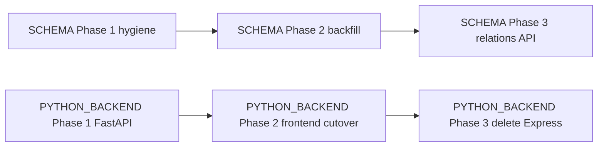
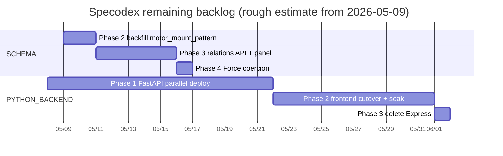

# Backlog

**This file is the entry point.** Reading this gets you the full picture
of what's left without opening each `todo/*.md`. Drill into the linked
docs only when you're about to act on that work.

> **Recently shipped (through 2026-05-08).** REBRAND, UNITS, INTEGRATION,
> FRONTEND_TESTING, CICD, the codegen toolchain (**MODELGEN Phase 0 +
> 0a-i + 0a-ii + 0b + 0c, end-to-end** — `models.ts` is now a re-export
> shim from `generated.ts`), Projects (per-user collections), **DEDUPE
> end-to-end** (Phase 1 audit + Phase 2 safe-merge + Phase 3 review-
> applier), data-quality observatory (`./Quickstart godmode`),
> `stripe_py/` Phase 1.1 layout, mobile-friendly compaction pass,
> **STYLE Phases 1 (Tooltip), 2 (ConfirmDialog), 5 (themed scrollbars),
> 6 (ExternalLink)** + CLAUDE.md "no native chrome" rule,
> **PYTHON_BACKEND Phase 5** (cli/ migration cleanup via deletion),
> auth Phases 1–4 + 5b WAF + 5d CSP/HSTS, **DB platform-harden**
> (IAM split, getCategories N+1 fix, prod deletion protection, Lambda
> Node 22, PITR), DB_CLEANUP (gearhead torque rename + electric_cylinder
> field drops + field-coverage audit CLI), filter-UX bug fixes
> (Tooltip ref-merging — column-header multi-select popovers were
> silently failing to anchor when wrapped in `<Tooltip>`; popover
> mode-before-selection — clicking exclude before any value picked was
> dropped) plus 19 new vitest cases covering the popover contract,
> and a **2026-05-08 dev → prod promotion of 1,657 records** (724 drives,
> 713 motors, 127 robot arms, 85 gearheads, 6 electric cylinders, 2
> linear actuators) at the 0.50 quality gate via `./Quickstart admin
> promote`.
>
> **Just deleted from `todo/`** (2026-05-09 cleanup): STYLE.md — scope
> shipped end-to-end (Phases 1+2+5+6 earlier; **Phases 3 (Toast), 4
> (FormField), 7 (drift gates) landed via PRs #69/#70/#68**, doc
> retired in PR #71). Earlier 2026-05-08 cleanup: MODELGEN.md,
> DEDUPE.md, PHASE5_RECOVERY.md — all three had their scope shipped
> end-to-end (MODELGEN Phase 0 + 0a-i/ii + 0b + 0c; DEDUPE Phases 1+2+3;
> PHASE5_RECOVERY via PR #65 landing 5a/5c/5e/5f on master). Earlier
> 2026-05-03 cleanup retired AUTH.md, REFACTOR.md, VISUALIZATION.md,
> GODMODE.md; before that REBRAND.md / UNITS.md / INTEGRATION.md /
> FRONTEND_TESTING.md. `git log --diff-filter=D --follow --
> todo/<NAME>.md` recovers any design rationale.
>
> **New on 2026-05-08:** [CATAGORIES.md](CATAGORIES.md) (supercategory
> taxonomy + procedural part-number configurator + `/actuators` MVP page
> design), [SCHEMA.md](SCHEMA.md) (Lintech/Toyo schema fit-check,
> cross-product field hygiene audit, device-relations design), and
> [CONFIGURATION.md](CONFIGURATION.md) (post-MVP rethink — six
> structural limits of the imperative-TS template approach + a
> declarative-YAML migration path). The first two have Phase 0/1 work
> on `feat-actuators-mvp-20260508`; CONFIGURATION is design-only,
> picked up after the MVP soaks. See "The churn plan" below for the
> ordered PR sequence.

> **New on 2026-05-09:** [BOARD_FEEDBACK.md](BOARD_FEEDBACK.md) (action
> subset of [longterm/BOARD.md](longterm/BOARD.md), the simulated
> five-person tech-board review). BOARD_FEEDBACK is the easy / high-
> agreement / no-external-decision items lifted out of the strategic
> board doc — pickable now, ≤ 1 day each. The strategic items
> (beachhead choice, engineer-direct vs B2B2C, hiring) stay in
> `longterm/BOARD.md` until Nick names them. Items 1+2+3 of
> BOARD_FEEDBACK landed via PR #75 (commit `2daecbb`); the remaining
> action items are queued in the doc, ordered by leverage.
>
> **New on 2026-05-09:** [GROWTH_CLI.md](GROWTH_CLI.md) (design-only).
> `./Quickstart growth` split into two halves on different clocks:
> **awareness now** (phase 1a `preflight` — composes `smoke` + `bench`
> + board P0 check + git status into a one-shot gate before any
> high-traffic post; phase 1b `facts` — paste-ready Markdown block of
> live product/manufacturer/bench/star numbers), **measurement later**
> (phases 2–7: GitHub traffic, Search Console, CloudFront logs,
> HN/Reddit mentions, Stripe, threshold flags — deferred until
> MARKETING.md phase 1 produces actual traffic; measuring zero
> traffic produces zero signal). Explicitly **not** a paid-ads
> orchestrator. Phase 1a/b are XS and could slot into the churn plan;
> phase 2+ stay out of churn and Late Night until there's a footprint
> to measure.

> **Long-term backlog (`todo/longterm/`).** `BOARD.md`, `MARKETING.md`,
> `PYTHON_STRIPE.md`, and `SEO.md` live here. The latter three were
> moved out of the active queue on 2026-05-09; `BOARD.md` was filed
> here on creation (it's a strategic review, not a queued workstream).
> **Treat these as inert** — they are deliberately excluded from the
> churn plan, chronological order, dependency graph, and Gantt below.
> Surface a long-term doc **only when Nick explicitly names it**
> ("look at SEO.md", "let's do the Stripe Python cutover", "what's
> in MARKETING?", "show me the board review"). Do NOT pull them into
> a short-term plan, do NOT suggest them as next-up work, and do NOT
> propose them as Late Night candidates. The Trigger-conditions table
> at the bottom keeps file-level pointers tagged `(longterm)` so a
> code edit that lands in their territory still gets a heads-up, but
> even then: surface, don't schedule. **Exception:** `BOARD.md`'s
> easy-pickings subset lives in active `BOARD_FEEDBACK.md` and is
> queued normally.

## How to use it

1. **Starting a session?** Open the [Specodex Orchestration board](https://github.com/users/JimothyJohn/projects/1) — it's the source of truth for what's active, blocked, or queued. Skim **The bottleneck** here for any operator-only actions.
2. **About to touch a file?** Scan **Trigger conditions** at the bottom — if anything matches, the linked doc is queued and worth reading first.
3. **Got an idle dev box overnight?** Pick from **Late Night** — curated tasks safe to run autonomously and easy to verify in the morning.
4. **Deferring new work?** Add a `todo/<AREA>.md` with a `## Triggers` section, then create a card on the board referencing it. Add a row to **Trigger conditions** below if the doc has file-level triggers.

> **Board access (CLI).** `gh project item-list 1 --owner JimothyJohn --format json`. Requires the `project` scope on the gh token. Full access pattern + field IDs in the auto-memory `reference_orchestration_board.md`.

---

## The bottleneck — operator queue

Drained as of 2026-04-30. No operator-only actions outstanding.

---

## Working tree state

Snapshot 2026-05-08. **Stale within hours; re-run `git status` and
`git worktree list` for ground truth.**

Active branch is `feat-actuators-mvp-20260508` with **uncommitted MVP
work from the prior session**:

- New: `app/frontend/src/components/ActuatorPage.{tsx,css}`,
  `app/frontend/src/types/{categories,configuratorTemplates,
  configuratorTemplates.test}.ts`,
  `todo/CATAGORIES.md`, `todo/SCHEMA.md`,
  `outputs/schema_fit_check/` (fit-check runner + per-PDF artifacts).
- Modified: `app/frontend/src/App.tsx` (route + nav), `app/package-lock.json`
  (pre-existing drift, not session-introduced).

The `pr-34` worktree at `/private/tmp/pr34` is from a separate review
session and is unrelated. The four stranded auth Phase 5 worktrees were
**resolved 2026-05-04** when Phase 5 landed — they should already be
cleaned up.

```
/Users/nick/github/specodex   feat-actuators-mvp-20260508    ← this one (uncommitted)
/private/tmp/pr34             pr-34                          (unrelated review)
```

The four stranded Phase 5 worktrees (`specodex-{ses,revoke,audit,alarms}`)
can be removed locally — PR #65 (`feat-auth-phase5-tail`) landed all of
5a/5c/5e/5f on master.

---

## Active work

**Tracked on the [Specodex Orchestration board](https://github.com/users/JimothyJohn/projects/1).** Status, Priority, and Size live there now — this section is no longer the source of truth.

Each card body links back to its `todo/<AREA>.md` doc. To add new work, create a card on the board referencing the doc; if the work has file-level triggers, also add a row to **Trigger conditions** below.

Active docs (2026-05-08):
- **CATAGORIES** — supercategory taxonomy + procedural part-number configurator + `/actuators` MVP page. Phase 0+1 uncommitted on `feat-actuators-mvp-20260508`. Companion to SCHEMA.md.
- **SCHEMA** — Lintech/Toyo schema fit-check + cross-product field hygiene + device-relations design. Phase 1 (additive migrations) **applied 2026-05-08, uncommitted**; Phase 1.1 (breaking type harmonisation, deferred for sign-off); Phases 2 (backfill) and 3 (relations API + RelationsPanel) follow; Phase 4 (Force coercion) is a small follow-up.
- **CONFIGURATION** — post-MVP architecture rethink. **Discovery + design only**, not in flight. Six structural MVP limits + a 6-phase migration to declarative YAML grammar + derivation graph + strict cross-device compat. Pick up after the MVP soaks ≥ 2 weeks and ≥ 3 user-visible signals.
- **PYTHON_BACKEND** (Phases 1–3 only)
- **BOARD_FEEDBACK** — easy / high-agreement / no-external-decision items lifted out of the simulated tech-board review (`longterm/BOARD.md`). Items 1+2+3 shipped via PR #75; remaining items queued in the doc, ordered by leverage.
- **API** — depends on a long-term Stripe cutover (`todo/longterm/PYTHON_STRIPE.md`); don't kick off until Nick re-activates it.
- **DB_CLEANUP** — Phase 1 shipped (gearhead torque + electric_cylinder field drops); Phase 2 (lead_time / warranty / msrp population) is open per the field-coverage audit.

Long-term docs (in `todo/longterm/`, **not** part of the active plan):
**BOARD**, **SEO**, **MARKETING**, **PYTHON_STRIPE**. Skip these unless
Nick explicitly calls one out.

CI/CD itself is healthy (full chain green; only outstanding bit is apex
`specodex.com` DNS) and now lives behind the `/cicd` skill rather than
a `todo/*.md` plan — invoke the skill or read
`.claude/skills/cicd/SKILL.md` for the runbook + foot-gun list.

---

## Suggested chronological order

With UNITS, REBRAND, INTEGRATION, FRONTEND_TESTING, GODMODE, CICD,
**MODELGEN end-to-end**, **DEDUPE end-to-end**, and **PHASE5_RECOVERY**
all landed, the remaining order:

1. **CATAGORIES + SCHEMA Phase 1 first.** The actuator MVP is uncommitted on `feat-actuators-mvp-20260508` and is half-shipped without the schema-hygiene work. Land Phase 1 of SCHEMA.md (additive cross-product fields + `MotorMountPattern` literal) on the same branch, then merge. Without this, the `/actuators` page is a calculator, not the integration story Nick framed.
2. **SCHEMA Phase 2 (backfill `motor_mount_pattern`) + Phase 3 (relations API).** After Phase 1 lands. Phase 2 is a Late Night candidate; Phase 3 is a focused PR.
3. **PYTHON_BACKEND Phase 1+** once everything above stops shifting. Don't start the FastAPI parallel-deploy on a moving target.
4. **BOARD_FEEDBACK action items** in any spare slot — each is ≤ 1 day, low risk, and orthogonal to the schema/actuator work. Pull from the top of the doc's ordered list.

**Out-of-band exceptions.** Urgent bugs, security issues, or user-visible breakage jump the queue. Long-term docs in `todo/longterm/` (BOARD, SEO, MARKETING, PYTHON_STRIPE) are deliberately omitted from this order — they're surfaced only when Nick names them.

---

## The churn plan — PRs in order

Each row is one reviewable PR. We churn through these top-to-bottom,
**one at a time, with Nick's permission per PR**. Every PR ships with
a per-PR HTML doc in `docs/requests/<n>.html` (see CLAUDE.md "Per-PR
documentation pages" — each merge updates the requests index).

| # | PR scope | Doc | Branch | Status |
|---|---|---|---|---|
| 1 | **Actuator MVP commit** — land the uncommitted CATAGORIES Phase 0+1 + SCHEMA Phase 1 work that's already on the working tree (supercategory map, `/actuators` page, additive cross-product fields, 6 configurator templates, schema fit-check artifacts) | CATAGORIES + SCHEMA | `feat-actuators-mvp-20260508` (current) | 🟡 ready to PR |
| 2 | **SCHEMA Phase 2** — backfill `motor_mount_pattern` from `frame_size` on dev DB, then promote | SCHEMA | new auto-branch | ⚪ queued |
| 3 | **SCHEMA Phase 3** — device-relations module + `/api/v1/relations/*` + `RelationsPanel` on `/actuators` ("Compatible motors for this configuration") | SCHEMA | new auto-branch | ⚪ queued |
| 4 | **SCHEMA Phase 4** — `kg → kgf → N` coercion on Force fields (surfaced by Lintech fit-check) | SCHEMA | new auto-branch | ⚪ queued |
| 5 | **SCHEMA Phase 1.1 (BREAKING)** — `motor_type` / `fieldbus` / `encoder_feedback_support` shape unification + one-shot data migration. Needs explicit sign-off. | SCHEMA | new auto-branch | 🔴 needs sign-off |
| 6 | **BOARD_FEEDBACK next item** — pull the next un-shipped action from `BOARD_FEEDBACK.md`'s ordered list (items 1+2+3 already shipped via PR #75). Each is ≤ 1 day. | BOARD_FEEDBACK | new auto-branch | ⚪ queued (independent) |
| 7 | **PYTHON_BACKEND Phase 1** — FastAPI parallel deploy | PYTHON_BACKEND | new auto-branch | ⚪ queued |
| 8 | **PYTHON_BACKEND Phase 2** — frontend cutover + soak | PYTHON_BACKEND | new auto-branch | ⚪ queued |
| 9 | **PYTHON_BACKEND Phase 3** — delete Express (retires `app/backend/src/types/models.ts` hand-edit) | PYTHON_BACKEND | new auto-branch | ⚪ queued |
| 10 | **API.md** — paid programmatic access tier. **Blocked on a long-term doc** (`todo/longterm/PYTHON_STRIPE.md` Phase 2 cutover) — don't queue until Nick re-activates Stripe. | API | new auto-branch | ⏸ blocked (longterm) |
| 11 | **CONFIGURATION Phase 1** — lift templates to YAML (`specodex/configurators/<vendor>/<family>.yaml` + codegen). Gated on ≥ 2-week MVP soak + ≥ 3 user signals. | CONFIGURATION | new auto-branch | ⏸ deferred |
| 12+ | **CONFIGURATION Phases 2–6** — declarative grammar, derivation graph, `./Quickstart configgen`, strict cross-device compat, need-first design surface | CONFIGURATION | new auto-branches | ⏸ deferred |
| ⋯ | **DB_CLEANUP Phase 2** — populate `lead_time` / `warranty` / `msrp` (per field-coverage audit) | DB_CLEANUP | new auto-branch | ⚪ queued (independent) |
| ✅ | ~~**STYLE Phase 3** — Toast primitive~~ shipped via PR #69 | — | `auto/style-phase3-toast-20260509` | ✅ shipped #69 |
| ✅ | ~~**STYLE Phase 4** — FormField primitive~~ shipped via PR #70 | — | `auto/style-phase4-forms-20260509` | ✅ shipped #70 |
| ✅ | ~~**STYLE Phase 7** — drift gates~~ shipped via PR #68 (Phase 7.1); doc retired in PR #71 | — | `auto/style-phase7-drift-gates-20260509` | ✅ shipped #68 |

**Long-term, not in the queue.** `todo/longterm/BOARD.md` (full
strategic tech-board review — beachhead choice, engineer-direct
vs B2B2C, hiring), `todo/longterm/PYTHON_STRIPE.md` (billing Lambda
deploy + SSM cutover + Rust delete), `todo/longterm/SEO.md`
(prerender / sitemap / content scaffolding), and
`todo/longterm/MARKETING.md` (public launch). The latter three were
churn-plan rows 6–8 and 12–14 before the 2026-05-09 move; BOARD was
filed in `longterm/` on creation. Re-add only when Nick explicitly
names one. (BOARD's easy-pickings subset lives in active
`BOARD_FEEDBACK.md` and is queued normally.)

**Status legend.** 🟡 = ready to PR now. ⚪ = queued, no blockers
beyond the row above. 🔴 = blocked on explicit human sign-off. ⏸ =
deliberately deferred.

**One PR at a time.** Don't open #2 until #1 is merged. Don't speculatively
branch ahead of the queue — context shifts as PRs land. Course-correct
the queue rather than the work.

---

## Parallelism & dependencies

**Hard blockers (must finish before dependent starts):**

- `SCHEMA Phase 1` (cross-product field hygiene) ⟶ `SCHEMA Phase 2` (backfill `motor_mount_pattern`) ⟶ `SCHEMA Phase 3` (relations API + frontend "Compatible motors" panel on `/actuators`)
- `CATAGORIES Phase 0` (actuator MVP page) ⟶ `SCHEMA Phase 3` (the Compatible-motors panel lives on the actuator page)
- `PYTHON_BACKEND Phase 1` ⟶ `Phase 2` ⟶ `Phase 3`

**Truly independent (run in any spare slot, in parallel with anything):**

- `BOARD_FEEDBACK` action items — each ≤ 1 day, low risk, orthogonal to schema/actuator work
- `DB_CLEANUP Phase 2` — populate `lead_time` / `warranty` / `msrp` per the field-coverage audit
- ~~`PYTHON_BACKEND Phase 5` (cli/migrations cleanup)~~ ✅ shipped 2026-04-30 (commit `c322393`)
- ~~`STYLE Phases 3 + 4 + 7`~~ ✅ shipped 2026-05-09 (PRs #69/#70/#68; doc retired #71)

> Long-term docs (`todo/longterm/PYTHON_STRIPE.md`, `SEO.md`,
> `MARKETING.md`) used to thread through this graph (`PYTHON_STRIPE
> 1.x → 2 → 3`, `SEO 1 → MARKETING 1`, `PYTHON_STRIPE 1 → API`).
> They're intentionally elided — re-stitch them when Nick names one.





> Bars are **rough estimates**, not commitments. The Gantt assumes a
> single engineer working serially within each section; parallel
> sections (PYTHON_BACKEND ‖ SCHEMA Phases 2–4 ‖ BOARD_FEEDBACK)
> compress the wall-clock if there's bandwidth to fan out, but most
> of these still gate on Nick's review and merge. Long-term work is
> **not** plotted — see `todo/longterm/`.

---

## Late Night

Curated tasks safe to run autonomously overnight on dev. Each one meets four criteria:

- **Bounded** — known finish line (queue size, fixture list, model count)
- **Dev-only writes** — no infrastructure touch, no shared-state mutation, no prod
- **Recoverable** — failure leaves dev DB consistent or rolls back cleanly
- **Morning-checkable** — clear go/no-go signal in artifacts; if green, ship to prod via existing `./Quickstart admin promote` flow

### Tier 1 — read-only or local-only (zero cost)

| Task | Command | Output to check |
|---|---|---|
| Bench (offline) | `./Quickstart bench` | `outputs/benchmarks/<ts>.json` — diff precision/recall vs `latest.json` |
| Ingest-report | `./Quickstart ingest-report --email-template` | `outputs/ingest_report_*.md` — quality fails grouped by manufacturer |
| UNITS review triage | `./Quickstart units-triage outputs/units_migration_review_dev_*.md` (script lives on branch `late-night-units-triage`) | `outputs/units_triage_<stage>_<source-ts>_triaged_<run-ts>.md` — pattern groups + suggested action per group |
| Integration test sweep | `./Quickstart verify --integration` | exit code; stale tests surface as failures |
| DEDUPE audit (Phase 1) | `./Quickstart audit-dedupes --stage dev` — read-only on dev DB | `outputs/dedupe_audit_dev_<ts>.json` + `outputs/dedupe_review_dev_<ts>.md`. Phases 2 (`--apply --safe-only`) and 3 (`--apply --from-review`) shipped 2026-05-07 — both write to dev only. |
| Field-coverage audit | `uv run python -m cli.audit_fields --stage dev` | `outputs/audit_fields_dev_<ts>.md` — drives `todo/DB_CLEANUP.md` Phase 2+ |

### Tier 2 — small Gemini cost, dev DB writes only

| Task | Command | Cost | Output to check |
|---|---|---|---|
| Schemagen on stockpiled PDFs | `./Quickstart schemagen <pdf>... --type <name>` | ~$0.10–0.50/PDF | `<type>.py` + `<type>.md` (ADR) per cluster |
| Price-enrich (dev) | `./Quickstart price-enrich --stage dev` | scraping + occasional Gemini | DynamoDB row counts before/after; spot-check 5–10 enriched rows in UI |

### Tier 3 — bounded but expensive (run weekly, not nightly)

| Task | Command | Cost | Output to check |
|---|---|---|---|
| Bench (live) | `./Quickstart bench --live --update-cache` | ~$1–5/run | precision/recall delta + cache delta — catches LLM-pipeline drift offline-bench can't see |
| Process upload queue | `./Quickstart process --stage dev` | unbounded — only run if queue size is known | products created in dev; smoke-check via `/api/v1/search` |

### Morning checklist (before promoting)

1. **Logs.** `tail -100 .logs/*.log` — no unhandled exceptions, no rate-limit spirals.
2. **Bench delta.** `diff outputs/benchmarks/latest.json outputs/benchmarks/<ts>.json` (or `jq` the precision/recall fields). Drop > 5pp on any fixture is a stop signal.
3. **Endpoint shape.** Hit dev `/health`, `/api/products/categories`, `/api/v1/search?type=motor&limit=5`. All should 200 with expected shape per CLAUDE.md "canonical endpoints".
4. **Newly-proposed types.** If schemagen ran: read each `<type>.md` ADR. Reject anything that hardcodes one vendor's quirks.
5. **DB sample.** UI walkthrough on http://localhost:5173: pick the new type, confirm filter chips + table columns render. Spot-check 5–10 newly-written / enriched rows.
6. **If green:** `./Quickstart admin promote --stage staging --since <ts>`, smoke staging, then `--stage prod`.
7. **If red or surprising:** damage is dev-only. `./Quickstart admin purge --stage dev --since <ts>` rolls back, then triage.

### Not Late Night material

- Anything touching `app/infrastructure/` (CDK) or `.github/workflows/` — needs human review.
- Any prod write or `./Quickstart admin promote --stage prod` — gated on morning checklist.
- SEO structural lifts (per-product page rendering, dynamic sitemap) — needs build + manual crawl check.

---

## Trigger conditions — when to surface which doc

If your current task matches any "trigger" entry, the linked doc is queued and worth raising before you go further. When multiple match, mention all. Surfacing once is cheap; silently shipping work that conflicts with a deferred plan is expensive.

Rows tagged **(longterm — surface only)** point into `todo/longterm/`.
Mention the doc so Nick can pull it back in if he wants to, but **do
not** add the work to the plan, schedule it, or treat it as queued —
those docs are inert until Nick names them.

| Trigger (files / topics in your current task) | Surface |
|---|---|
| `specodex/models/common.py` (`MotorMountPattern`, `MotorTechnology`), `specodex/models/{linear_actuator,electric_cylinder,motor,drive,gearhead}.py` cross-product fields (`encoder_feedback_support`, `fieldbus`, `motor_type`, `frame_size`); user asks "compatible motor", "matching drive", "device pairing", "integration", "transform part numbers" | [SCHEMA.md](SCHEMA.md) |
| `app/frontend/src/types/{categories,configuratorTemplates}.ts`, `app/frontend/src/components/ActuatorPage.tsx`; user asks "supercategory", "subcategory", "actuator landing page", "configurator template", "synthesise part number", "ordering information page" | [CATAGORIES.md](CATAGORIES.md) |
| `app/frontend/index.html` head metadata, `app/frontend/public/{robots.txt,sitemap.xml}`, JSON-LD blocks, OG/Twitter card tags, per-product page rendering, dynamic sitemap, prerender/SSR, "SEO", "canonical", "search ranking", "OG image" | [longterm/SEO.md](longterm/SEO.md) **(longterm — surface only)** |
| Landing-page copy, "marketing", "launch", "audience", "Reddit / HN / mailing list", outreach plans, paid spend (don't), Stripe pricing surface | [longterm/MARKETING.md](longterm/MARKETING.md) **(longterm — surface only)** |
| `cli/growth.py`, `specodex/growth/`, "growth CLI", "engagement footprint", "Google Ads", "Meta Marketing", "LinkedIn Ads", "feedback loop on traffic", Search Console / GitHub traffic / CloudFront logs into a weekly report | [GROWTH_CLI.md](GROWTH_CLI.md) |
| `.github/workflows/`, `cli/quickstart.py`, push to master, deploy attempt, "CI red", `HOSTED_ZONE_ID`/`HOSTED_ZONE_NAME`/`DOMAIN_NAME`/`CERTIFICATE_ARN`, `gh-deploy-datasheetminer`, OIDC trust policy, apex/`www` domain support, `app/infrastructure/lib/config.ts:hostedZoneName` fallback | `/cicd` skill (`.claude/skills/cicd/SKILL.md`) |
| `app/backend/src/` beyond a bug fix, new endpoint, new middleware, "FastAPI", "Mangum", "rewrite Express in Python" | [PYTHON_BACKEND.md](PYTHON_BACKEND.md) |
| `stripe/` (Rust source), `stripe_py/` (Python port), Stripe webhook handler, `${ssmPrefix}/stripe-lambda-url`, billing Lambda deploy or cutover | [longterm/PYTHON_STRIPE.md](longterm/PYTHON_STRIPE.md) **(longterm — surface only)** |
| Programmatic API access, long-lived API keys, per-key rate limits, `/api/v1/*` from non-SPA callers, paid Stripe surface activation | [API.md](API.md) |
| `README.md` brand copy ("Datasheetminer" vs "Specodex"), GitHub repo description / social-preview image, external bios / LinkedIn / Twitter, landing-page provenance signals (date-of-extraction, source PDF page, model version), BOM export shape, "Project" persistence; user asks "brand split", "engineer trust signals", "audit trail", "easy-pickings", "low-leverage win" | [BOARD_FEEDBACK.md](BOARD_FEEDBACK.md) |
| Beachhead market choice, engineer-direct vs B2B2C strategy, hiring decisions, distribution-partner conversations, persona-level UX overhauls; user asks "what would a board say", "is the strategy right", "what's the bigger risk" | [longterm/BOARD.md](longterm/BOARD.md) **(longterm — surface only)** |
| New JSX with `title=`, `window.confirm`, `alert(`, `<form>` without `noValidate`, bare `target="_blank"`, `<input type="checkbox">` without `appearance: none`, raw `overflow: auto/scroll` in CSS; any user-triggered `console.error` without a paired toast; reaching for `<select>`/`<input type="file">`/`<dialog>`/`<details>` | `./Quickstart verify` drift gates (STYLE.md retired 2026-05-09 after Phase 7.1) |
