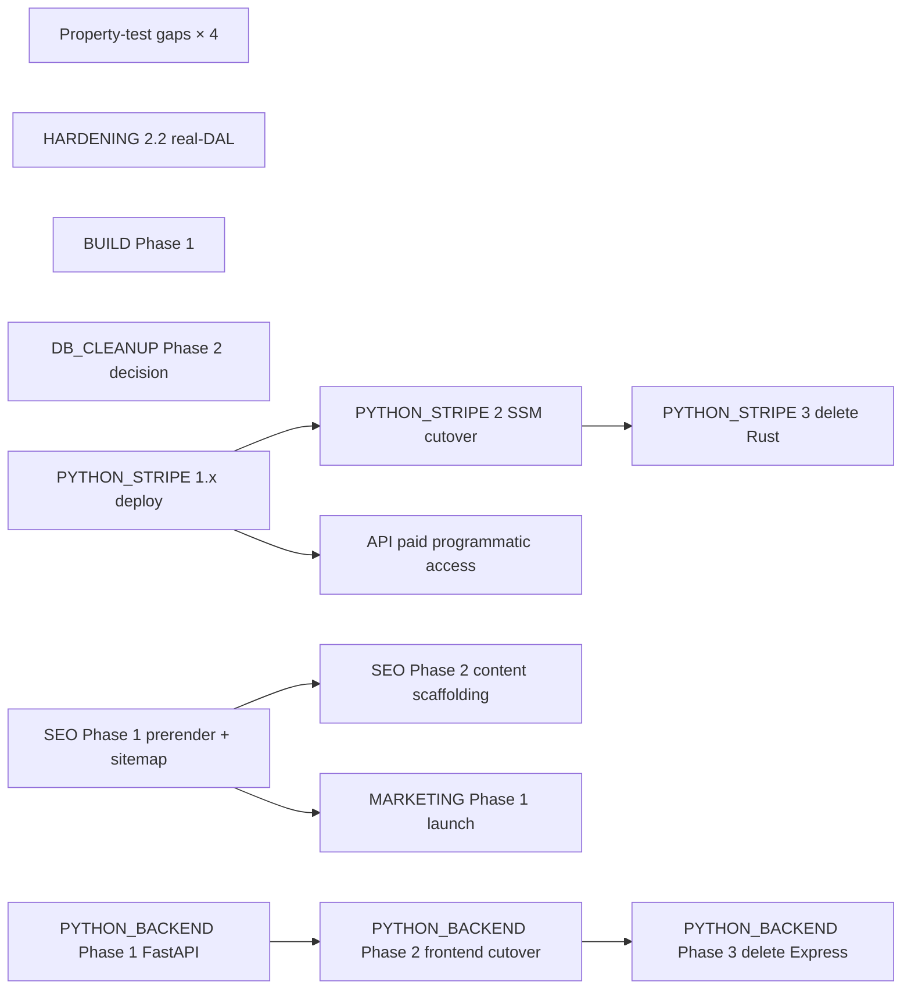

# Backlog

**This file is the entry point.** Reading this gets you the full picture
of what's left without opening each `todo/*.md`. Drill into the linked
docs only when you're about to act on that work.

> **Recently shipped (2026-05-10 sprint — 21 PRs in one day).**
> All of HARDENING Phase 3.1 (parse_gemini_response, common.py
> BeforeValidators, find_spec_pages_by_text), Phase 3.3 (schema
> forward/backward compat tests with frozen JSON snapshots per
> ProductType), Phase 3.4 (concurrent-write stress test via moto +
> ThreadPoolExecutor), the property-test sweep over encoder/drive
> coercers, gearhead falsy-value coerce, the validate_url SSRF
> defense, merge_per_page_products, and the double_tap verifier.
> Plus **SCHEMA Phase 4** (kg → kgf → N Force coercion via per-family
> pre_rewrite on UnitFamily), **SCHEMA Phase 2** (motor_mount_pattern
> backfill CLI, dry-run default), the **CodeQL #66 cleanup** (dead
> `_CANONICAL_DEVICES` global), the **test_resilience.py de-flake**
> (module autouse wait + lru_cache patch), a CLAUDE.md "Property
> testing — adversarial by default" conventions section, and 3
> docs-syncs of per-PR HTML pages.
>
> **Three real bugs caught and fixed by Hypothesis this sprint:**
> (1) `_coerce_ip_rating` returned `list`/`tuple`/`float` inputs
> unchanged instead of `None`; bool inputs slipped through
> `isinstance(v, int)` and became IP ratings 1/0 — fixed in PR #112.
> (2) `_coerce_protocol_list([""])` returned `[""]` instead of
> `["unknown"]`, killing Drive rows via the `Literal[EncoderProtocol]`
> validator — fixed in PR #116. (3) `Gearhead.coerce_string_fields`
> leaked Python dict-repr (`"{'value': 0, 'unit': 'mm'}"`, `"{}"`)
> for falsy values — fixed in PR #118. Each was a bug where the
> docstring said one thing and the code did another; the property
> test pinned the documented contract and the code revealed itself.
>
> **Earlier (2026-05-09 → 2026-05-10):** SCHEMA Phase 1 (PR #87),
> SCHEMA Phase 3 end-to-end (PRs #89/#90/#92), DOUBLE_TAP end-to-end
> (PR #91), BUILD scaffold (PR #94), categorical DistributionChart
> in ColumnHeader (PR #88), recovered design docs (PR #85),
> linear-actuator type discoverability (PR #86), and HARDENING
> Phase 1+2+4 sweep (PRs #95/#97/#98/#100/#101/#103/#102) plus
> quickstart npm-ci correctness fix (#99) and lockfile Node 20
> regen (#96).
>
> **Earlier (through 2026-05-08).** REBRAND, UNITS, INTEGRATION,
> FRONTEND_TESTING, CICD, the codegen toolchain (MODELGEN Phase 0 +
> 0a-i + 0a-ii + 0b + 0c, end-to-end), Projects (per-user
> collections), DEDUPE end-to-end (Phase 1 audit + Phase 2 safe-merge
> + Phase 3 review-applier), data-quality observatory
> (`./Quickstart godmode`), `stripe_py/` Phase 1.1 layout,
> mobile-friendly compaction pass, STYLE Phases 1–7.1 end-to-end +
> CLAUDE.md "no native chrome" rule (todo/STYLE.md retired),
> PYTHON_BACKEND Phase 5, auth Phases 1–4 + 5b WAF + 5d CSP/HSTS,
> DB platform-harden, DB_CLEANUP (gearhead torque rename +
> electric_cylinder field drops + audit CLI), filter-UX bug fixes,
> and a 2026-05-08 dev → prod promotion of 1,657 records.
>
> **Just deleted from `todo/`** (2026-05-08 cleanup): MODELGEN.md,
> DEDUPE.md, PHASE5_RECOVERY.md — scope shipped end-to-end. Earlier
> 2026-05-03 cleanup retired AUTH.md, REFACTOR.md, VISUALIZATION.md,
> GODMODE.md; before that REBRAND.md / UNITS.md / INTEGRATION.md /
> FRONTEND_TESTING.md. `git log --diff-filter=D --follow --
> todo/<NAME>.md` recovers any design rationale.

## How to use it

1. **Starting a session?** Open the [Specodex Orchestration board](https://github.com/users/JimothyJohn/projects/1) — it's the source of truth for what's active, blocked, or queued.
2. **About to touch a file?** Scan **Trigger conditions** at the bottom — if anything matches, the linked doc is queued and worth reading first.
3. **Got an idle dev box overnight?** Pick from **Late Night** — curated tasks safe to run autonomously and easy to verify in the morning.
4. **Deferring new work?** Add a `todo/<AREA>.md` with a `## Triggers` section, then create a card on the board referencing it. Add a row to **Trigger conditions** below if the doc has file-level triggers.

> **Board access (CLI).** `gh project item-list 1 --owner JimothyJohn --format json`. Requires the `project` scope on the gh token. Full access pattern + field IDs in the auto-memory `reference_orchestration_board.md`.

---

## Working tree state

Snapshot 2026-05-10 (end of the 21-PR sprint). **Stale within
hours; re-run `git status` and `git worktree list` for ground
truth.**

Master is at the post-PR-#116 cohort. Of the 21 sprint PRs:
**13 merged**, **8 ready+CI-green and queued for Nick's review**:
#117 (SCHEMA Phase 2 backfill CLI), #118 (Gearhead falsy-value
fix), #119 (docs-sync 116–118), #120 (url_safety SSRF property
tests), #121 (CLAUDE.md known-issues cleanup), #122 (merge
invariants property tests), #123 (double_tap verifier property
tests), #124 (CLAUDE.md property-test conventions).

Side-worktrees are now mostly stale (their branches merged earlier
in the sprint). Run `git worktree list` for ground truth and
`git worktree remove <path>` to prune any whose branch shows in
the merged list above.

---

## Active work

**Tracked on the [Specodex Orchestration board](https://github.com/users/JimothyJohn/projects/1).** Status, Priority, and Size live there now — this section is no longer the source of truth.

Each card body links back to its `todo/<AREA>.md` doc. To add new work, create a card on the board referencing the doc; if the work has file-level triggers, also add a row to **Trigger conditions** below.

Active docs (2026-05-10, post-sprint):

- **HARDENING** — adversarial-by-default posture audit. After the
  sprint: Phase 1.1, 1.3, 2.1, 2.3, 2.4, 3.1 (all 3 targets), 3.3,
  3.4, 4.1, 4.3 shipped. **Open:** Phase 1.2 (`uv sync --locked` CI
  sweep — touches `.github/workflows/`, needs human PR), Phase 2.2
  (real-DAL backend tests, L), Phase 3.2 (atheris fuzz, heavy dep),
  Phase 4.2 (lockfile-drift CI gate — touches workflows). Plus
  CLAUDE.md "Property testing — adversarial by default" section
  (PR #124) lists 4 untested adversarial surfaces as the next-
  sprint queue.
- **SCHEMA** — Phase 1, 3 (all three sub-phases), 4 shipped; Phase
  2 backfill CLI shipped as PR #117 (dry-run default — execution
  is a separate operator action). **Open:** Phase 1.1 (BREAKING
  `motor_type`/`fieldbus`/`encoder_feedback_support` shape
  unification + one-shot data migration — needs sign-off).
- **BUILD** — requirements-first system assembler page that
  generalises `/actuators`. **Design-only.** Hard prereqs (SCHEMA
  Phase 3 ✓, linear_actuator discoverability ✓) shipped. Phase 1
  implementation can start anytime; first user-facing work in the
  next-sprint queue.
- **DOUBLE_TAP** — encoder schema rethink + verifier loop. All
  phases shipped via PR #91. Doc + appendix retained as
  architecture reference for the closed taxonomy + verifier-loop
  pattern. The verifier surface gained property-test coverage in
  PR #123.
- **CATAGORIES** — supercategory map + `/actuators` MVP. Phase 0+1
  shipped (PRs #85/#87/#94). Phase 2+ (additional supercategories
  beyond Linear Motion) not yet scoped.
- **BOARD_FEEDBACK** — items 1–3 (README brand cleanup + PUBLIC.md
  continuity + takedown policy) shipped 2026-05-09. Items 4–9 are
  founder-driven decisions no PR can close (manufacturer outreach,
  paid-tier price, customer-conversation log, etc.). Doc retained
  as the working register for those items.
- **SEO**, **MARKETING** — public-launch readiness. Now genuinely
  next-up for user-facing impact.
- **PYTHON_BACKEND** (Phases 1–3) — FastAPI parallel deploy →
  frontend cutover → Express deletion. Soft-blocked on STYLE / DB /
  SCHEMA churn settling; that's mostly done now.
- **PYTHON_STRIPE** (Phases 1.x → 2 → 3) — billing Lambda deploy +
  SSM cutover + Rust crate retirement. Code scaffolded; needs the
  operator-driven deploy.
- **API** — paid programmatic-access tier. Depends on PYTHON_STRIPE
  Phase 2 cutover (billing live) + SES (already deployed).
- **DB_CLEANUP** — Phase 2 (populate or drop `lead_time` /
  `warranty` / `msrp`) is open. The 2026-05-07 field-coverage audit
  recommended *dropping* these fields outright since the LLM never
  populates them; the README's Phase 2 framing of "populate" is
  stale — re-decide before implementing.
- **CONFIGURATION** — post-MVP architecture rethink. Design-only,
  gated on ≥ 2-week MVP soak.
- **GROWTH_CLI** — engagement-footprint reporting. Phase 1 preflight
  gate is queued; not blocking anything.

`todo/STYLE.md` was retired 2026-05-08 — all seven STYLE phases shipped.

CI/CD itself is healthy (full chain green; only outstanding bit is
apex `specodex.com` DNS) and now lives behind the `/cicd` skill
rather than a `todo/*.md` plan.

---

## Suggested chronological order

The 2026-05-10 sprint cleared most of the previously-named queue.
The remaining order, ranked by leverage / unblocked-ness:

1. **Property-test gap coverage** — the four surfaces called out in
   CLAUDE.md's new "Property testing" section: `cli/processor.py`
   (upload-queue dispatch + S3 key parsing), `specodex/integration/compat.py`
   (`_scalar` / `_range` / `_check_*`), `specodex/spec_rules.py:validate_product`
   (magnitude rules), `specodex/quality.py:score_product` (quality
   scoring). Each is one small clean PR, follows the established
   pattern from this sprint, and is the high-probability ground for
   finding bug #4.
2. **HARDENING Phase 2.2** (backend real-DAL integration tests).
   Large but code-only; the existing mocked-table tests don't
   catch DynamoDB-specific bugs.
3. **BUILD Phase 1** — requirements-first Build page. Now
   unblocked, first user-facing work in the queue. Higher impact
   than another property test if the next sprint wants something
   visible.
4. **SCHEMA Phase 2 *execution*** — operator runs the
   `./Quickstart admin -- backfill-motor-mounts --stage dev --apply`
   on dev, verifies, then promotes. The script is shipped (PR #117);
   running it is one operator action.
5. **DB_CLEANUP Phase 2 decision** — the field-coverage audit's
   recommendation conflicts with the README's previous framing.
   Decide whether to populate or drop `lead_time` / `warranty` /
   `msrp` before implementing either.
6. **PYTHON_STRIPE 1.x deploy → 2 cutover → 3 delete Rust crate.**
   Operator-driven deploy chain.
7. **SEO Phase 1** — prerender + sitemap + per-product page
   rendering. Multi-day structural work but the marketing prereq.
8. **MARKETING Phase 1** — Show HN + Reddit + GitHub README polish.
   Don't do this until SEO Phase 1 lands (Show HN with broken
   indexing wastes the shot).
9. **PYTHON_BACKEND Phase 1** — FastAPI parallel deploy. Don't
   start on a moving target; do this once the above stops shifting.
10. **HARDENING Phase 2.2 / 3.2 / 4.2 / 1.2** — the remaining
    HARDENING items. 1.2 + 4.2 touch `.github/workflows/` so
    they're skip-list for autonomous sprints; 2.2 + 3.2 are
    code-only but heavier than the Phase 3.1 wins.

**Out-of-band exceptions.** Urgent bugs, security issues, or
user-visible breakage jump the queue.

---

## The churn plan — PRs in order for the next sprint

Each row is one reviewable PR. We churn through these
top-to-bottom, **one at a time, with Nick's permission per PR**.
Every PR ships with a per-PR HTML doc in `docs/requests/<n>.html`
(see CLAUDE.md "Per-PR documentation pages").

| # | PR scope | Doc | Status |
|---|---|---|---|
| 1 | **Property tests — `cli/processor.py` upload-queue dispatch + S3 key parsing** | HARDENING | 🟡 ready to PR |
| 2 | **Property tests — `specodex/integration/compat.py` (`_scalar` / `_range` / `_check_*`)** | HARDENING | 🟡 ready to PR |
| 3 | **Property tests — `specodex/spec_rules.py:validate_product` magnitude rules** | HARDENING | 🟡 ready to PR |
| 4 | **Property tests — `specodex/quality.py:score_product`** | HARDENING | 🟡 ready to PR |
| 5 | **HARDENING Phase 2.2** — real-DAL backend integration tests (L) | HARDENING | ⚪ queued |
| 6 | **BUILD Phase 1** — requirements-first Build page (motion/stroke/speed/payload/orientation form → motion-system kit) | BUILD | ⚪ queued (independent, user-facing) |
| 7 | **DB_CLEANUP Phase 2 decision** — populate vs drop `lead_time` / `warranty` / `msrp` (audit says drop; README says populate) | DB_CLEANUP | 🔴 needs sign-off |
| 8 | **SCHEMA Phase 1.1 (BREAKING)** — `motor_type` / `fieldbus` / `encoder_feedback_support` shape unification + one-shot data migration | SCHEMA | 🔴 needs sign-off |
| 9 | **PYTHON_STRIPE Phase 1.x deploy** — billing Lambda goes live on dev, dev round-trip, soak | PYTHON_STRIPE | ⚪ queued (operator-driven deploy) |
| 10 | **PYTHON_STRIPE Phase 2** — SSM cutover + 7-day soak | PYTHON_STRIPE | ⚪ queued |
| 11 | **PYTHON_STRIPE Phase 3** — delete Rust crate (subsumes PYTHON_BACKEND Phase 4) | PYTHON_STRIPE | ⚪ queued |
| 12 | **SEO Phase 1** — prerender + sitemap + per-product page rendering | SEO | ⚪ queued (multi-day, needs human PR for build config) |
| 13 | **SEO Phase 2** — content scaffolding | SEO | ⚪ queued |
| 14 | **MARKETING Phase 1** — public launch (Show HN, mailing list) | MARKETING | ⚪ queued |
| 15 | **PYTHON_BACKEND Phase 1** — FastAPI parallel deploy | PYTHON_BACKEND | ⚪ queued |
| 16 | **PYTHON_BACKEND Phase 2** — frontend cutover + soak | PYTHON_BACKEND | ⚪ queued |
| 17 | **PYTHON_BACKEND Phase 3** — delete Express (retires `app/backend/src/types/models.ts` hand-edit) | PYTHON_BACKEND | ⚪ queued |
| 18 | **API.md** — paid programmatic access tier (depends on Stripe Phase 2 cutover + SES) | API | ⚪ queued |
| 19 | **HARDENING Phase 3.2** — atheris fuzz target for PDF intake | HARDENING | ⚪ queued (heavier dep — needs LLVM/clang on macOS) |
| 20 | **HARDENING Phase 1.2** — `uv sync --locked` sweep across CI workflows | HARDENING | ⚪ queued (touches `.github/workflows/` — needs human PR) |
| 21 | **HARDENING Phase 4.2** — lockfile-drift gate post-install | HARDENING | ⚪ queued (touches CI — needs human PR) |
| 22 | **CONFIGURATION Phase 1** — lift configurator templates to YAML | CONFIGURATION | ⏸ deferred (gated on ≥ 2-week MVP soak) |
| 23+ | **CONFIGURATION Phases 2–6** | CONFIGURATION | ⏸ deferred |
| ⋯ | **GROWTH_CLI Phase 1** — preflight gate (engagement footprint + Search Console + GitHub traffic) | GROWTH_CLI | ⚪ queued (independent) |
| ⋯ | **CATAGORIES Phase 2+** — additional supercategories beyond Linear Motion | CATAGORIES | ⚪ queued (not yet scoped) |

**Status legend.** 🟡 = ready to PR now. ⚪ = queued, no blockers
beyond the row above. 🔴 = blocked on explicit human sign-off. ⏸ =
deliberately deferred.

**One PR at a time.** Don't open #2 until #1 is merged. Don't
speculatively branch ahead of the queue — context shifts as PRs
land.

---

## Parallelism & dependencies

**Hard blockers (must finish before dependent starts):**

- `SCHEMA Phase 2 execution (operator)` ⟶ promote `motor_mount_pattern` to staging/prod
- `PYTHON_STRIPE 1.x deploy` ⟶ `API.md` (paid surface assumes billing Lambda is live)
- `PYTHON_STRIPE 1.x deploy` ⟶ `PYTHON_STRIPE 2 cutover` ⟶ `PYTHON_STRIPE 3 delete Rust`
- `PYTHON_BACKEND Phase 1` ⟶ `Phase 2` ⟶ `Phase 3`
- `SEO Phase 1` ⟶ `MARKETING Phase 1` (Show HN with broken indexing wastes the shot)

**Truly independent (run in any spare slot, in parallel with anything):**

- Property-test gap coverage rows (#1–#4) — code-only, no shared state.
- `BUILD Phase 1` — frontend feature, independent of all backend rows.
- `GROWTH_CLI Phase 1` — independent reporting CLI.
- `HARDENING Phase 2.2 / 3.2` — code-only adversarial coverage.

---

## Late Night

Curated tasks safe to run autonomously overnight on dev. Each one meets four criteria:

- **Bounded** — known finish line (queue size, fixture list, model count)
- **Dev-only writes** — no infrastructure touch, no shared-state mutation, no prod
- **Recoverable** — failure leaves dev DB consistent or rolls back cleanly
- **Morning-checkable** — clear go/no-go signal in artifacts

### Tier 1 — read-only or local-only (zero cost)

| Task | Command | Output to check |
|---|---|---|
| Bench (offline) | `./Quickstart bench` | `outputs/benchmarks/<ts>.json` — diff precision/recall vs `latest.json` |
| Ingest-report | `./Quickstart ingest-report --email-template` | `outputs/ingest_report_*.md` — quality fails grouped by manufacturer |
| Integration test sweep | `./Quickstart verify --integration` | exit code; stale tests surface as failures |
| DEDUPE audit (Phase 1) | `./Quickstart audit-dedupes --stage dev` | `outputs/dedupe_audit_dev_<ts>.json` |
| Field-coverage audit | `uv run python -m cli.audit_fields --stage dev` | `outputs/audit_fields_dev_<ts>.md` |
| Motor-mount backfill **dry-run** | `./Quickstart admin -- backfill-motor-mounts --stage dev` | summary + sample mappings (no writes) |

### Tier 2 — small Gemini cost, dev DB writes only

| Task | Command | Cost | Output to check |
|---|---|---|---|
| Schemagen on stockpiled PDFs | `./Quickstart schemagen <pdf>... --type <name>` | ~$0.10–0.50/PDF | `<type>.py` + `<type>.md` (ADR) per cluster |
| Price-enrich (dev) | `./Quickstart price-enrich --stage dev` | scraping + occasional Gemini | DynamoDB row counts before/after |
| Motor-mount backfill **apply** | `./Quickstart admin -- backfill-motor-mounts --stage dev --apply` | none (DynamoDB writes only) | success/failure counts + before/after row sample |

### Tier 3 — bounded but expensive (run weekly, not nightly)

| Task | Command | Cost | Output to check |
|---|---|---|---|
| Bench (live) | `./Quickstart bench --live --update-cache` | ~$1–5/run | precision/recall delta + cache delta |
| Process upload queue | `./Quickstart process --stage dev` | unbounded — only run if queue size is known | products created in dev; smoke-check via `/api/v1/search` |

### Morning checklist (before promoting)

1. **Logs.** `tail -100 .logs/*.log` — no unhandled exceptions, no rate-limit spirals.
2. **Bench delta.** `diff outputs/benchmarks/latest.json outputs/benchmarks/<ts>.json`. Drop > 5pp on any fixture is a stop signal.
3. **Endpoint shape.** Hit dev `/health`, `/api/products/categories`, `/api/v1/search?type=motor&limit=5`. All should 200 with expected shape per CLAUDE.md "canonical endpoints".
4. **DB sample.** UI walkthrough on http://localhost:5173: pick a product type, confirm filter chips + table columns render.
5. **If green:** `./Quickstart admin promote --stage staging --since <ts>`, smoke staging, then `--stage prod`.
6. **If red or surprising:** damage is dev-only. `./Quickstart admin purge --stage dev --since <ts>` rolls back, then triage.

### Not Late Night material

- Anything touching `app/infrastructure/` (CDK) or `.github/workflows/` — needs human review.
- Any prod write or `./Quickstart admin promote --stage prod` — gated on morning checklist.
- SEO structural lifts (per-product page rendering, dynamic sitemap) — needs build + manual crawl check.

---

## Trigger conditions — when to surface which doc

If your current task matches any "trigger" entry, the linked doc is queued and worth raising before you go further. When multiple match, mention all.

| Trigger (files / topics in your current task) | Surface |
|---|---|
| New parser, deserializer, coercer, or `BeforeValidator`; CodeQL log-injection or input-handling finding; user asks "fuzz", "property test", "input validation" | [HARDENING.md](HARDENING.md) + CLAUDE.md "Property testing — adversarial by default" |
| `cli/processor.py`, `specodex/integration/compat.py`, `specodex/spec_rules.py`, `specodex/quality.py` | CLAUDE.md "Property testing" untested-surfaces list — these four are the next-sprint targets |
| `specodex/models/common.py` (`MotorMountPattern`, `ProductType`), `specodex/models/{linear_actuator,electric_cylinder,motor,drive,gearhead}.py` cross-product fields; user asks "compatible motor", "matching drive", "device pairing", "integration", "transform part numbers" | [SCHEMA.md](SCHEMA.md) — Phase 1.1 is BREAKING and needs sign-off; everything else shipped |
| `app/frontend/src/types/{categories,configuratorTemplates}.ts`, `app/frontend/src/components/ActuatorPage.tsx`; user asks "supercategory", "subcategory", "actuator landing page", "configurator template", "synthesise part number", "ordering information page" | [CATAGORIES.md](CATAGORIES.md) |
| `app/frontend/src/components/Build*.tsx`, `/build` route, requirements form, system-assembler page; user asks "build page", "requirements-first", "motion class", "system assembler", "wizard" | [BUILD.md](BUILD.md) — Phase 1 unblocked |
| `specodex/models/encoder.py`, `EncoderDevice` / `EncoderProtocol` enums, structured `EncoderFeedback`, verifier-loop runner, bench A/B harness; user asks "encoder taxonomy", "verifier loop", "second-pass extraction", "encoder compat" | [DOUBLE_TAP.md](DOUBLE_TAP.md) + [appendix](DOUBLE_TAP_encoder_taxonomy.md) — phases shipped, doc retained as architecture reference |
| `app/frontend/index.html` head metadata, `app/frontend/public/{robots.txt,sitemap.xml}`, JSON-LD blocks, OG/Twitter card tags, per-product page rendering, dynamic sitemap, prerender/SSR, "SEO", "canonical", "search ranking", "OG image" | [SEO.md](SEO.md) |
| Landing-page copy, "marketing", "launch", "audience", "Reddit / HN / mailing list", outreach plans, paid spend (don't), Stripe pricing surface | [MARKETING.md](MARKETING.md) |
| `cli/growth.py`, `specodex/growth/`, "growth CLI", "engagement footprint", "Google Ads", "Meta Marketing", "LinkedIn Ads", "feedback loop on traffic", Search Console / GitHub traffic / CloudFront logs into a weekly report | [GROWTH_CLI.md](GROWTH_CLI.md) |
| `.github/workflows/`, `cli/quickstart.py`, push to master, deploy attempt, "CI red", `HOSTED_ZONE_ID`/`HOSTED_ZONE_NAME`/`DOMAIN_NAME`/`CERTIFICATE_ARN`, `gh-deploy-datasheetminer`, OIDC trust policy, apex/`www` domain support | `/cicd` skill (`.claude/skills/cicd/SKILL.md`) |
| `app/backend/src/` beyond a bug fix, new endpoint, new middleware, "FastAPI", "Mangum", "rewrite Express in Python" | [PYTHON_BACKEND.md](PYTHON_BACKEND.md) |
| `stripe/` (Rust source), `stripe_py/` (Python port), Stripe webhook handler, `${ssmPrefix}/stripe-lambda-url`, billing Lambda deploy or cutover | [PYTHON_STRIPE.md](PYTHON_STRIPE.md) |
| Programmatic API access, long-lived API keys, per-key rate limits, `/api/v1/*` from non-SPA callers, paid Stripe surface activation | [API.md](API.md) |
| New HTTP endpoint, middleware, or auth refactor in `app/backend/src/routes/`; user asks "IDOR", "auth bypass", "cross-tenant" | [HARDENING.md](HARDENING.md) Phase 2.3 (shipped — pattern to follow) |
| Any URL-fetching path in `specodex/` (scraper, pricing, browser); user asks "SSRF", "metadata", "internal hostname" | [HARDENING.md](HARDENING.md) Phase 2.1 (shipped) + `validate_url` |
| Stripe webhook handler change; new external-integration retry logic; user asks "replay attack", "idempotency", "webhook signature" | [HARDENING.md](HARDENING.md) Phase 2.4 (shipped — pattern to follow) |
| Adding a new `ProductType` literal or model field to `specodex/models/` | CLAUDE.md "Adding a new product type" — includes step 5 for snapshot refresh |
| Founder-driven items (manufacturer outreach, paid-tier price, customer-conversation log) | [BOARD_FEEDBACK.md](BOARD_FEEDBACK.md) |
