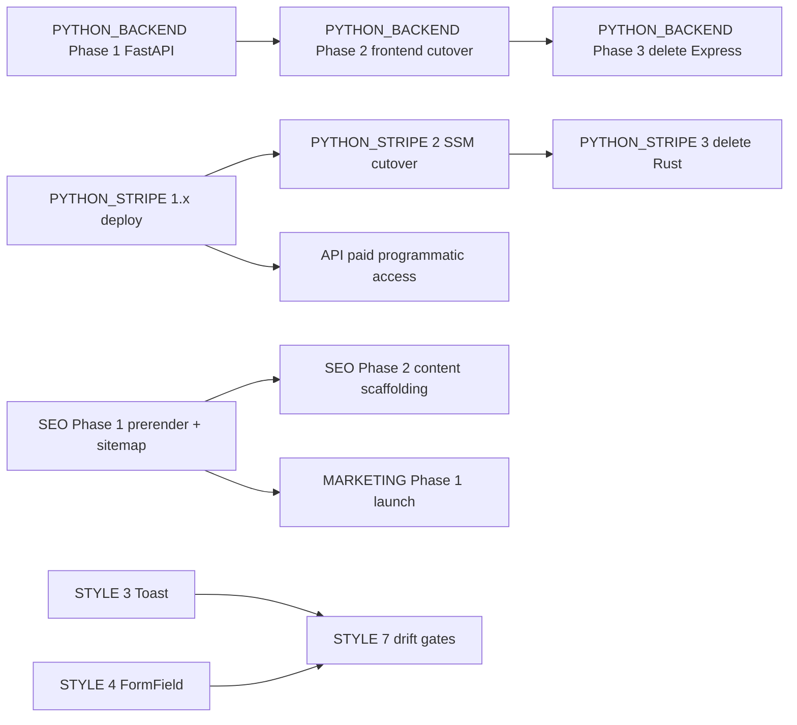
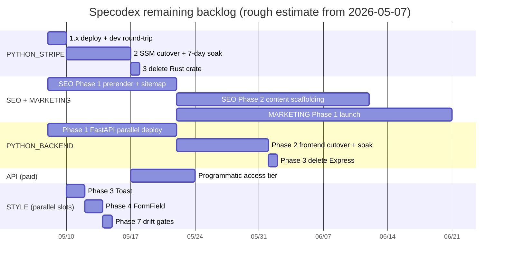

# Backlog

**This file is the entry point.** Reading this gets you the full picture
of what's left without opening each `todo/*.md`. Drill into the linked
docs only when you're about to act on that work.

> **Recently shipped (through 2026-05-08).** REBRAND, UNITS, INTEGRATION,
> FRONTEND_TESTING, CICD, the codegen toolchain (**MODELGEN Phase 0 +
> 0a-i + 0a-ii + 0b + 0c, end-to-end** — `models.ts` is now a re-export
> shim from `generated.ts`), Projects (per-user collections), **DEDUPE
> end-to-end** (Phase 1 audit + Phase 2 safe-merge + Phase 3 review-
> applier), data-quality observatory (`./Quickstart godmode`),
> `stripe_py/` Phase 1.1 layout, mobile-friendly compaction pass,
> **STYLE Phases 1 (Tooltip), 2 (ConfirmDialog), 3 (Toast), 4
> (noValidate + JS form validation + themed checkbox), 5 (themed
> scrollbars), 6 (ExternalLink), 7.1 (Quickstart verify drift gate)**
> + CLAUDE.md "no native chrome" rule (todo/STYLE.md retired),
> **PYTHON_BACKEND Phase 5** (cli/ migration cleanup via deletion),
> auth Phases 1–4 + 5b WAF + 5d CSP/HSTS, **DB platform-harden**
> (IAM split, getCategories N+1 fix, prod deletion protection, Lambda
> Node 22, PITR), DB_CLEANUP (gearhead torque rename + electric_cylinder
> field drops + field-coverage audit CLI), filter-UX bug fixes
> (Tooltip ref-merging — column-header multi-select popovers were
> silently failing to anchor when wrapped in `<Tooltip>`; popover
> mode-before-selection — clicking exclude before any value picked was
> dropped) plus 19 new vitest cases covering the popover contract,
> and a **2026-05-08 dev → prod promotion of 1,657 records** (724 drives,
> 713 motors, 127 robot arms, 85 gearheads, 6 electric cylinders, 2
> linear actuators) at the 0.50 quality gate via `./Quickstart admin
> promote`.
>
> **Just deleted from `todo/`** (2026-05-08 cleanup): MODELGEN.md,
> DEDUPE.md, PHASE5_RECOVERY.md — all three had their scope shipped
> end-to-end (MODELGEN Phase 0 + 0a-i/ii + 0b + 0c; DEDUPE Phases 1+2+3;
> PHASE5_RECOVERY via PR #65 landing 5a/5c/5e/5f on master). Earlier
> 2026-05-03 cleanup retired AUTH.md, REFACTOR.md, VISUALIZATION.md,
> GODMODE.md; before that REBRAND.md / UNITS.md / INTEGRATION.md /
> FRONTEND_TESTING.md. `git log --diff-filter=D --follow --
> todo/<NAME>.md` recovers any design rationale.
>
> **New on 2026-05-08:** [CATAGORIES.md](CATAGORIES.md) (supercategory
> taxonomy + procedural part-number configurator + `/actuators` MVP page
> design), [SCHEMA.md](SCHEMA.md) (Lintech/Toyo schema fit-check,
> cross-product field hygiene audit, device-relations design), and
> [CONFIGURATION.md](CONFIGURATION.md) (post-MVP rethink — six
> structural limits of the imperative-TS template approach + a
> declarative-YAML migration path). The first two have Phase 0/1 work
> on `feat-actuators-mvp-20260508`; CONFIGURATION is design-only,
> picked up after the MVP soaks. See "The churn plan" below for the
> ordered PR sequence.
>
> **New on 2026-05-09:** [HARDENING.md](HARDENING.md) — adversarial-by-default
> testing posture audit (14 findings, 4 phases). Phase 1 = three immediate
> wins (~1.5h total): rename `_test_security.py` to activate 376 lines of
> dormant tests, `uv sync --locked` sweep across CI workflows, regression
> tests for the freshly-shipped log-injection PRs (#82/#83/#84). Phase 2 =
> real attacker surface (SSRF defense, IDOR coverage, Stripe webhook
> replay/signature, real-DAL backend tests). Independent of the rest of
> the backlog — run in parallel with whatever else is in flight.
>
> **Recently shipped (2026-05-09 → 2026-05-10).** **SCHEMA Phase 1**
> (PR #87 — `MotorMountPattern` literal + bridge fields), **SCHEMA Phase
> 3 end-to-end** (PR #89 Phase 3a `relations.py`, PR #90 Phase 3b
> `/api/v1/relations` endpoints, PR #92 Phase 3c `RelationsPanel`
> skeleton), **DOUBLE_TAP end-to-end** (PR #91 — closed `EncoderDevice`
> + `EncoderProtocol` taxonomy, structured `EncoderFeedback` model,
> typed compat checker, verifier-loop runner, bench A/B harness),
> **BUILD scaffold + RelationsPanel URL fix** (PR #94 — `/build`
> route placeholder + bug fix to relations panel),
> **categorical DistributionChart in ColumnHeader** (PR #88), recovered
> design docs (PR #85 — SCHEMA, CATAGORIES, CONFIGURATION docs landed),
> linear-actuator type discoverability fix (PR #86), and a **HARDENING
> Phase 1+2+4 sweep**: 1.1 `_test_security.py` rename (PR #95), 1.3
> log-injection regressions (PR #97), 2.1 SSRF defense (PR #98), 2.3
> IDOR + cross-tenant tests (PR #100), 2.4 Stripe webhook replay/signature
> /tamper tests (PR #101), 4.1 mutmut + pytest-randomly + freezegun
> dev-deps (PR #103), 4.3 log secret-leak assertion tests (PR #102).
> Plus quickstart `npm ci` correctness fix (PR #99) and lockfile
> regen under Node 20 (PR #96).
>
> **New on 2026-05-09 → 2026-05-10:** [BOARD_FEEDBACK.md](BOARD_FEEDBACK.md)
> (founder-driven action subset of `longterm/BOARD.md` — items 1–3
> shipped 2026-05-09, items 4–9 are founder-driven decisions),
> [BUILD.md](BUILD.md) (requirements-first system assembler — the
> third user-facing page, generalising `/actuators`; design-only,
> depends on SCHEMA Phase 3 ✓), [DOUBLE_TAP.md](DOUBLE_TAP.md) and
> its appendix [DOUBLE_TAP_encoder_taxonomy.md](DOUBLE_TAP_encoder_taxonomy.md)
> (encoder-feedback schema rethink + verifier-loop extraction — phases
> 1+2 and 3+4+5+6 shipped via PR #91; doc retained as architecture
> reference for the closed taxonomy + verifier loop).

## How to use it

1. **Starting a session?** Open the [Specodex Orchestration board](https://github.com/users/JimothyJohn/projects/1) — it's the source of truth for what's active, blocked, or queued. Skim **The bottleneck** here for any operator-only actions.
2. **About to touch a file?** Scan **Trigger conditions** at the bottom — if anything matches, the linked doc is queued and worth reading first.
3. **Got an idle dev box overnight?** Pick from **Late Night** — curated tasks safe to run autonomously and easy to verify in the morning.
4. **Deferring new work?** Add a `todo/<AREA>.md` with a `## Triggers` section, then create a card on the board referencing it. Add a row to **Trigger conditions** below if the doc has file-level triggers.

> **Board access (CLI).** `gh project item-list 1 --owner JimothyJohn --format json`. Requires the `project` scope on the gh token. Full access pattern + field IDs in the auto-memory `reference_orchestration_board.md`.

---

## The bottleneck — operator queue

Drained as of 2026-04-30. No operator-only actions outstanding.

---

## Working tree state

Snapshot 2026-05-10. **Stale within hours; re-run `git status` and
`git worktree list` for ground truth.**

Master is at the post-PR-#103 cohort (HARDENING Phase 1+2+4 sweep,
SCHEMA Phase 1 + 3a/3b/3c, DOUBLE_TAP, BUILD scaffold). The actuator
MVP and SCHEMA Phase 1 work that was uncommitted on
`feat-actuators-mvp-20260508` has all landed.

Live worktrees (re-run `git worktree list` for ground truth):

```
/Users/nick/github/specodex                   master                                          (this one)
/Users/nick/github/specodex-build-scaffold    feat/build-page-scaffold-20260510               (shipped via PR #94 — can prune)
/Users/nick/github/specodex-chart             feat/categorical-column-histogram-20260509      (shipped via PR #88 — can prune)
/Users/nick/github/specodex-hardening         auto/hardening-4-1-adversarial-deps-20260509    (shipped via PR #103 — can prune)
/Users/nick/github/specodex-lockfile-node20   fix/lockfile-node20-regen-20260510              (shipped via PR #96 — can prune)
/Users/nick/github/specodex-quickstart-fix    fix/quickstart-npm-ci-20260510                  (shipped via PR #99 — can prune)
/Users/nick/github/specodex-relations-api     feat/schema-phase3b-relations-api-20260510      (shipped via PR #90 — can prune)
```

Five of the six side-worktrees are now stale (their branches merged).
A separate worktree-GC pass can prune them.

---

## Active work

**Tracked on the [Specodex Orchestration board](https://github.com/users/JimothyJohn/projects/1).** Status, Priority, and Size live there now — this section is no longer the source of truth.

Each card body links back to its `todo/<AREA>.md` doc. To add new work, create a card on the board referencing the doc; if the work has file-level triggers, also add a row to **Trigger conditions** below.

Active docs (2026-05-10):
- **CATAGORIES** — supercategory taxonomy + procedural part-number configurator + `/actuators` MVP page. Phase 0+1 shipped via PRs #85/#87. Companion to SCHEMA.md and BUILD.md.
- **SCHEMA** — Lintech/Toyo schema fit-check + cross-product field hygiene + device-relations design. Phase 1 (additive migrations) and Phase 3 (relations API + RelationsPanel) **shipped 2026-05-09 via PRs #87/#89/#90/#92**; Phase 1.1 (breaking type harmonisation, deferred for sign-off); Phase 2 (backfill `motor_mount_pattern` from `frame_size` on dev DB, then promote) and Phase 4 (Force coercion `kg→kgf→N`) remain.
- **BUILD** — requirements-first system assembler — third user-facing page that generalises `/actuators` into a Build page driven by motion/stroke/speed/payload/orientation requirements. **Design-only as of 2026-05-09.** Hard prereqs (SCHEMA Phase 3 ✓, linear_actuator discoverability fix ✓) both shipped — Phase 1 implementation can start whenever it's prioritised.
- **DOUBLE_TAP** — encoder-feedback schema rethink + verifier-loop extraction. **Phases 1+2 (closed `EncoderDevice`/`EncoderProtocol` taxonomy + structured `EncoderFeedback` + typed compat) and 3+4+5+6 (verifier-loop runner + bench A/B harness) shipped 2026-05-09 via PR #91.** Doc + appendix retained as architecture reference for the closed taxonomy and verifier-loop pattern.
- **BOARD_FEEDBACK** — easy/obvious subset of `longterm/BOARD.md`. Items 1–3 (README brand cleanup + PUBLIC.md continuity + takedown policy) shipped 2026-05-09. Items 4–9 are founder-driven decisions that no PR can close (manufacturer outreach, paid tier price, customer-conversation log, etc.).
- **CONFIGURATION** — post-MVP architecture rethink. **Discovery + design only**, not in flight. Six structural MVP limits + a 6-phase migration to declarative YAML grammar + derivation graph + strict cross-device compat. Pick up after the MVP soaks ≥ 2 weeks and ≥ 3 user-visible signals.
- **SEO**, **MARKETING**
- **PYTHON_BACKEND** (Phases 1–3 only)
- **PYTHON_STRIPE**
- **API**
- **DB_CLEANUP** — Phase 1 shipped (gearhead torque + electric_cylinder field drops); Phase 2 (lead_time / warranty / msrp population) is open per the field-coverage audit.
- **HARDENING** — adversarial-by-default testing posture audit (2026-05-09). 14 findings across 4 phases. **Phase 1.1 (PR #95), 1.3 (#97), 2.1 (#98), 2.3 (#100), 2.4 (#101), 4.1 (#103), 4.3 (#102) shipped 2026-05-09 → 10.** Open: Phase 1.2 (`uv sync --locked` CI sweep — touches `.github/workflows/`), Phase 2.2 (real-DAL backend tests), Phase 3.1–3.4 (Hypothesis + atheris + schema-compat + concurrent-write stress), Phase 4.2 (lockfile-drift gate). Companion to the `~/.claude/CLAUDE.md` "Testing — adversarial by default" rules.

`todo/STYLE.md` was retired 2026-05-08 — the per-PR HTML callouts above
mention all seven STYLE phases as shipped (Tooltip, ConfirmDialog,
Toast, FormField + noValidate, themed scrollbars, ExternalLink,
Quickstart drift gate).

CI/CD itself is healthy (full chain green; only outstanding bit is apex
`specodex.com` DNS) and now lives behind the `/cicd` skill rather than
a `todo/*.md` plan — invoke the skill or read
`.claude/skills/cicd/SKILL.md` for the runbook + foot-gun list.

---

## Suggested chronological order

With UNITS, REBRAND, INTEGRATION, FRONTEND_TESTING, GODMODE, CICD,
**MODELGEN end-to-end**, **DEDUPE end-to-end**, **PHASE5_RECOVERY**,
**STYLE end-to-end**, **CATAGORIES Phase 0+1**, **SCHEMA Phase 1+3
end-to-end**, **DOUBLE_TAP end-to-end**, and the **HARDENING Phase
1+2+4 sweep** all landed, the remaining order:

1. **SCHEMA Phase 4** (Force coercion, `kg → kgf → N`) — small clean
   PR; can ship anytime. Surfaces Lintech load-rating coverage.
2. **HARDENING Phase 3.x** — adversarial input coverage (Hypothesis
   property tests, atheris fuzz, schema forward/backward compat,
   concurrent-write stress). Code-only, sprint-able in parallel.
3. **HARDENING Phase 2.2** — backend integration tests against real
   DAL. Larger but code-only.
4. **PYTHON_STRIPE Phase 1 deploy + Phase 2 cutover.** Code is
   scaffolded; just needs deploy + soak. Operator-driven (deploy
   command), so a sprint can stage the code PR but not the deploy.
5. **SEO + MARKETING.** Public launch is now possible. SEO structural
   lifts pair with marketing distribution; product pages serve both.
6. **SCHEMA Phase 2** (backfill `motor_mount_pattern`) — Late Night
   candidate. Borderline for autonomous sprint (writes to dev DB).
7. **BUILD Phase 1** — requirements-first system assembler. Now
   unblocked by SCHEMA Phase 3 + linear_actuator discoverability fix.
8. **PYTHON_BACKEND Phase 1+** once everything above stops shifting.
   Don't start the FastAPI parallel-deploy on a moving target.

**Out-of-band exceptions.** Urgent bugs, security issues, or user-visible breakage jump the queue.

---

## The churn plan — PRs in order

Each row is one reviewable PR. We churn through these top-to-bottom,
**one at a time, with Nick's permission per PR**. Every PR ships with
a per-PR HTML doc in `docs/requests/<n>.html` (see CLAUDE.md "Per-PR
documentation pages" — each merge updates the requests index).

| # | PR scope | Doc | Branch | Status |
|---|---|---|---|---|
| 1 | ~~**Actuator MVP commit** — land the uncommitted CATAGORIES Phase 0+1 + SCHEMA Phase 1 work~~ | CATAGORIES + SCHEMA | shipped via PRs #85 + #87 | ✅ shipped 2026-05-09 |
| 2 | **SCHEMA Phase 2** — backfill `motor_mount_pattern` from `frame_size` on dev DB, then promote | SCHEMA | new auto-branch | ⚪ queued |
| 3 | ~~**SCHEMA Phase 3** — device-relations module + `/api/v1/relations/*` + `RelationsPanel` on `/actuators`~~ | SCHEMA | shipped via PRs #89 + #90 + #92 | ✅ shipped 2026-05-09/10 |
| 4 | **SCHEMA Phase 4** — `kg → kgf → N` coercion on Force fields (surfaced by Lintech fit-check) | SCHEMA | new auto-branch | 🟡 ready to PR |
| 5 | **SCHEMA Phase 1.1 (BREAKING)** — `motor_type` / `fieldbus` / `encoder_feedback_support` shape unification + one-shot data migration. Needs explicit sign-off. | SCHEMA | new auto-branch | 🔴 needs sign-off |
| 6 | **PYTHON_STRIPE Phase 1.x deploy** — billing Lambda goes live on dev, dev round-trip, soak | PYTHON_STRIPE | new auto-branch | ⚪ queued |
| 7 | **PYTHON_STRIPE Phase 2** — SSM cutover + 7-day soak | PYTHON_STRIPE | new auto-branch | ⚪ queued |
| 8 | **PYTHON_STRIPE Phase 3** — delete Rust crate (subsumes PYTHON_BACKEND Phase 4) | PYTHON_STRIPE | new auto-branch | ⚪ queued |
| 9 | ~~**STYLE Phase 3** — Toast primitive~~ | STYLE | shipped (todo/STYLE.md retired) | ✅ shipped (pre-2026-05-08) |
| 10 | ~~**STYLE Phase 4** — FormField primitive~~ | STYLE | shipped (todo/STYLE.md retired) | ✅ shipped (pre-2026-05-08) |
| 11 | ~~**STYLE Phase 7** — drift gates in `./Quickstart verify`~~ | STYLE | shipped (todo/STYLE.md retired) | ✅ shipped (pre-2026-05-08) |
| 12 | **SEO Phase 1** — prerender + sitemap + per-product page rendering | SEO | new auto-branch | ⚪ queued |
| 13 | **SEO Phase 2** — content scaffolding | SEO | new auto-branch | ⚪ queued |
| 14 | **MARKETING Phase 1** — public launch (Show HN, mailing list) | MARKETING | new auto-branch | ⚪ queued |
| 15 | **PYTHON_BACKEND Phase 1** — FastAPI parallel deploy | PYTHON_BACKEND | new auto-branch | ⚪ queued |
| 16 | **PYTHON_BACKEND Phase 2** — frontend cutover + soak | PYTHON_BACKEND | new auto-branch | ⚪ queued |
| 17 | **PYTHON_BACKEND Phase 3** — delete Express (retires `app/backend/src/types/models.ts` hand-edit) | PYTHON_BACKEND | new auto-branch | ⚪ queued |
| 18 | **API.md** — paid programmatic access tier (depends on Stripe Phase 2 cutover + PHASE5_RECOVERY's SES) | API | new auto-branch | ⚪ queued |
| 19 | **CONFIGURATION Phase 1** — lift templates to YAML (`specodex/configurators/<vendor>/<family>.yaml` + codegen). Gated on ≥ 2-week MVP soak + ≥ 3 user signals. | CONFIGURATION | new auto-branch | ⏸ deferred |
| 20+ | **CONFIGURATION Phases 2–6** — declarative grammar, derivation graph, `./Quickstart configgen`, strict cross-device compat, need-first design surface | CONFIGURATION | new auto-branches | ⏸ deferred |
| ⋯ | **BUILD Phase 1** — implement the requirements-first Build page (motion/stroke/speed/payload/orientation form → recommended motion-system kit) per `todo/BUILD.md`. Hard prereqs (SCHEMA Phase 3 ✓, linear_actuator discoverability ✓) both shipped. | BUILD | new auto-branch | ⚪ queued (independent) |
| ⋯ | **DB_CLEANUP Phase 2** — populate `lead_time` / `warranty` / `msrp` (per field-coverage audit) | DB_CLEANUP | new auto-branch | ⚪ queued (independent) |
| ⋯ | ~~**HARDENING Phase 1.1 + 1.3**~~ — `_test_security.py` rename + log-injection regression tests | HARDENING | shipped via PRs #95 + #97 | ✅ shipped 2026-05-09 |
| ⋯ | **HARDENING Phase 1.2** — `uv sync --locked` sweep across CI workflows | HARDENING | new auto-branch | ⚪ queued (touches `.github/workflows/` — needs human PR) |
| ⋯ | ~~**HARDENING Phase 2.1**~~ — SSRF defense for URL-fetching paths | HARDENING | shipped via PR #98 | ✅ shipped 2026-05-09 |
| ⋯ | **HARDENING Phase 2.2** — backend integration tests against real DAL (L) | HARDENING | new auto-branch | ⚪ queued |
| ⋯ | ~~**HARDENING Phase 2.3 + 2.4**~~ — IDOR + cross-tenant tests + Stripe webhook signature/replay tests | HARDENING | shipped via PRs #100 + #101 | ✅ shipped 2026-05-09 |
| ⋯ | **HARDENING Phase 3.x** — adversarial input coverage: 3.1 Hypothesis property tests, 3.2 atheris fuzz target, 3.3 schema forward/backward compat, 3.4 concurrent-write stress | HARDENING | new auto-branch each | ⚪ queued |
| ⋯ | ~~**HARDENING Phase 4.1 + 4.3**~~ — mutmut + pytest-randomly + freezegun dev-deps + log secret-leak assertion tests | HARDENING | shipped via PRs #103 + #102 | ✅ shipped 2026-05-09/10 |
| ⋯ | **HARDENING Phase 4.2** — lockfile-drift gate post-install | HARDENING | new auto-branch | ⚪ queued |

**Status legend.** 🟡 = ready to PR now. ⚪ = queued, no blockers
beyond the row above. 🔴 = blocked on explicit human sign-off. ⏸ =
deliberately deferred.

**One PR at a time.** Don't open #2 until #1 is merged. Don't speculatively
branch ahead of the queue — context shifts as PRs land. Course-correct
the queue rather than the work.

---

## Parallelism & dependencies

**Hard blockers (must finish before dependent starts):**

- `SCHEMA Phase 1` (cross-product field hygiene) ⟶ `SCHEMA Phase 2` (backfill `motor_mount_pattern`) ⟶ `SCHEMA Phase 3` (relations API + frontend "Compatible motors" panel on `/actuators`)
- `CATAGORIES Phase 0` (actuator MVP page) ⟶ `SCHEMA Phase 3` (the Compatible-motors panel lives on the actuator page)
- `PYTHON_STRIPE 1.x deploy` ⟶ `API.md` (paid surface assumes the billing Lambda is live)
- `PYTHON_STRIPE 1.x deploy` ⟶ `PYTHON_STRIPE 2 cutover` ⟶ `PYTHON_STRIPE 3 delete Rust`
- `PYTHON_BACKEND Phase 1` ⟶ `Phase 2` ⟶ `Phase 3`
- `SEO Phase 1` ⟶ `MARKETING Phase 1` (Show HN with broken indexing wastes the shot)
- `STYLE Phases 3 + 4` ⟶ `STYLE Phase 7 (drift gates)`

**Soft sequencing (ergonomic, not technical):**

- `PYTHON_STRIPE Phase 3` (delete Rust) ⟶ `PYTHON_BACKEND Phase 4` is moot — the work is the same, do it once via PYTHON_STRIPE.
- STYLE Phases 3 (Toast) and 4 (FormField) both touch shared state — single-stream them, but they don't block any non-STYLE work.

**Truly independent (run in any spare slot, in parallel with anything):**

- `PYTHON_STRIPE 1.x deploy`
- `SEO Phase 1`
- `STYLE Phase 3 (Toast)` — closes ~25 silent failure paths in AppContext / DatasheetEditModal alert
- `HARDENING Phase 1.x` — three immediate wins (`_test_security.py` rename, `uv sync --locked`, log-injection regressions); ~1.5h total
- `HARDENING Phase 2.x` — real attacker surface (SSRF, IDOR, Stripe replay, real-DAL backend tests); multi-day
- `HARDENING Phase 3.x + 4.x` — adversarial input coverage (property/fuzz/schema-compat/concurrent-stress) + hygiene (mutmut/randomly/freezegun, lockfile-drift gate, log-leak tests)
- ~~`PYTHON_BACKEND Phase 5` (cli/migrations cleanup)~~ ✅ shipped 2026-04-30 (commit `c322393`)





> Bars are **rough estimates**, not commitments. The Gantt assumes a
> single engineer working serially within each section; parallel
> sections (PYTHON_STRIPE ‖ SEO ‖ STYLE ‖ SCHEMA Phases 2/3) compress
> the wall-clock if there's bandwidth to fan out, but most of these
> still gate on Nick's review and merge.

---

## Late Night

Curated tasks safe to run autonomously overnight on dev. Each one meets four criteria:

- **Bounded** — known finish line (queue size, fixture list, model count)
- **Dev-only writes** — no infrastructure touch, no shared-state mutation, no prod
- **Recoverable** — failure leaves dev DB consistent or rolls back cleanly
- **Morning-checkable** — clear go/no-go signal in artifacts; if green, ship to prod via existing `./Quickstart admin promote` flow

### Tier 1 — read-only or local-only (zero cost)

| Task | Command | Output to check |
|---|---|---|
| Bench (offline) | `./Quickstart bench` | `outputs/benchmarks/<ts>.json` — diff precision/recall vs `latest.json` |
| Ingest-report | `./Quickstart ingest-report --email-template` | `outputs/ingest_report_*.md` — quality fails grouped by manufacturer |
| UNITS review triage | `./Quickstart units-triage outputs/units_migration_review_dev_*.md` (script lives on branch `late-night-units-triage`) | `outputs/units_triage_<stage>_<source-ts>_triaged_<run-ts>.md` — pattern groups + suggested action per group |
| Integration test sweep | `./Quickstart verify --integration` | exit code; stale tests surface as failures |
| DEDUPE audit (Phase 1) | `./Quickstart audit-dedupes --stage dev` — read-only on dev DB | `outputs/dedupe_audit_dev_<ts>.json` + `outputs/dedupe_review_dev_<ts>.md`. Phases 2 (`--apply --safe-only`) and 3 (`--apply --from-review`) shipped 2026-05-07 — both write to dev only. |
| Field-coverage audit | `uv run python -m cli.audit_fields --stage dev` | `outputs/audit_fields_dev_<ts>.md` — drives `todo/DB_CLEANUP.md` Phase 2+ |

### Tier 2 — small Gemini cost, dev DB writes only

| Task | Command | Cost | Output to check |
|---|---|---|---|
| Schemagen on stockpiled PDFs | `./Quickstart schemagen <pdf>... --type <name>` | ~$0.10–0.50/PDF | `<type>.py` + `<type>.md` (ADR) per cluster |
| Price-enrich (dev) | `./Quickstart price-enrich --stage dev` | scraping + occasional Gemini | DynamoDB row counts before/after; spot-check 5–10 enriched rows in UI |

### Tier 3 — bounded but expensive (run weekly, not nightly)

| Task | Command | Cost | Output to check |
|---|---|---|---|
| Bench (live) | `./Quickstart bench --live --update-cache` | ~$1–5/run | precision/recall delta + cache delta — catches LLM-pipeline drift offline-bench can't see |
| Process upload queue | `./Quickstart process --stage dev` | unbounded — only run if queue size is known | products created in dev; smoke-check via `/api/v1/search` |

### Morning checklist (before promoting)

1. **Logs.** `tail -100 .logs/*.log` — no unhandled exceptions, no rate-limit spirals.
2. **Bench delta.** `diff outputs/benchmarks/latest.json outputs/benchmarks/<ts>.json` (or `jq` the precision/recall fields). Drop > 5pp on any fixture is a stop signal.
3. **Endpoint shape.** Hit dev `/health`, `/api/products/categories`, `/api/v1/search?type=motor&limit=5`. All should 200 with expected shape per CLAUDE.md "canonical endpoints".
4. **Newly-proposed types.** If schemagen ran: read each `<type>.md` ADR. Reject anything that hardcodes one vendor's quirks.
5. **DB sample.** UI walkthrough on http://localhost:5173: pick the new type, confirm filter chips + table columns render. Spot-check 5–10 newly-written / enriched rows.
6. **If green:** `./Quickstart admin promote --stage staging --since <ts>`, smoke staging, then `--stage prod`.
7. **If red or surprising:** damage is dev-only. `./Quickstart admin purge --stage dev --since <ts>` rolls back, then triage.

### Not Late Night material

- Anything touching `app/infrastructure/` (CDK) or `.github/workflows/` — needs human review.
- Any prod write or `./Quickstart admin promote --stage prod` — gated on morning checklist.
- SEO structural lifts (per-product page rendering, dynamic sitemap) — needs build + manual crawl check.

---

## Trigger conditions — when to surface which doc

If your current task matches any "trigger" entry, the linked doc is queued and worth raising before you go further. When multiple match, mention all. Surfacing once is cheap; silently shipping work that conflicts with a deferred plan is expensive.

| Trigger (files / topics in your current task) | Surface |
|---|---|
| `specodex/models/common.py` (`MotorMountPattern`, `MotorTechnology`), `specodex/models/{linear_actuator,electric_cylinder,motor,drive,gearhead}.py` cross-product fields (`encoder_feedback_support`, `fieldbus`, `motor_type`, `frame_size`); user asks "compatible motor", "matching drive", "device pairing", "integration", "transform part numbers" | [SCHEMA.md](SCHEMA.md) |
| `app/frontend/src/types/{categories,configuratorTemplates}.ts`, `app/frontend/src/components/ActuatorPage.tsx`; user asks "supercategory", "subcategory", "actuator landing page", "configurator template", "synthesise part number", "ordering information page" | [CATAGORIES.md](CATAGORIES.md) |
| `app/frontend/src/components/Build*.tsx`, `/build` route, requirements form, system-assembler page; user asks "build page", "requirements-first", "motion class", "system assembler", "wizard" | [BUILD.md](BUILD.md) |
| `specodex/models/encoder.py`, `EncoderDevice` / `EncoderProtocol` enums, structured `EncoderFeedback`, verifier-loop runner, bench A/B harness; user asks "encoder taxonomy", "verifier loop", "second-pass extraction", "encoder compat" | [DOUBLE_TAP.md](DOUBLE_TAP.md) + [appendix](DOUBLE_TAP_encoder_taxonomy.md) (architecture reference — phases all shipped) |
| `app/frontend/index.html` head metadata, `app/frontend/public/{robots.txt,sitemap.xml}`, JSON-LD blocks, OG/Twitter card tags, per-product page rendering, dynamic sitemap, prerender/SSR, "SEO", "canonical", "search ranking", "OG image" | [SEO.md](SEO.md) |
| Landing-page copy, "marketing", "launch", "audience", "Reddit / HN / mailing list", outreach plans, paid spend (don't), Stripe pricing surface | [MARKETING.md](MARKETING.md) |
| `cli/growth.py`, `specodex/growth/`, "growth CLI", "engagement footprint", "Google Ads", "Meta Marketing", "LinkedIn Ads", "feedback loop on traffic", Search Console / GitHub traffic / CloudFront logs into a weekly report | [GROWTH_CLI.md](GROWTH_CLI.md) |
| `.github/workflows/`, `cli/quickstart.py`, push to master, deploy attempt, "CI red", `HOSTED_ZONE_ID`/`HOSTED_ZONE_NAME`/`DOMAIN_NAME`/`CERTIFICATE_ARN`, `gh-deploy-datasheetminer`, OIDC trust policy, apex/`www` domain support, `app/infrastructure/lib/config.ts:hostedZoneName` fallback | `/cicd` skill (`.claude/skills/cicd/SKILL.md`) |
| `app/backend/src/` beyond a bug fix, new endpoint, new middleware, "FastAPI", "Mangum", "rewrite Express in Python" | [PYTHON_BACKEND.md](PYTHON_BACKEND.md) |
| `stripe/` (Rust source), `stripe_py/` (Python port), Stripe webhook handler, `${ssmPrefix}/stripe-lambda-url`, billing Lambda deploy or cutover | [PYTHON_STRIPE.md](PYTHON_STRIPE.md) |
| Programmatic API access, long-lived API keys, per-key rate limits, `/api/v1/*` from non-SPA callers, paid Stripe surface activation | [API.md](API.md) |
| New HTTP endpoint, middleware, or auth refactor in `app/backend/src/routes/`; user asks "IDOR", "auth bypass", "cross-tenant" | [HARDENING.md](HARDENING.md) Phase 2.3 |
| Any URL-fetching path in `specodex/` (scraper, pricing, browser); user asks "SSRF", "metadata", "internal hostname" | [HARDENING.md](HARDENING.md) Phase 2.1 |
| New parser, deserializer, or `BeforeValidator`; CodeQL log-injection or input-handling finding; user asks "fuzz", "property test", "input validation" | [HARDENING.md](HARDENING.md) Phases 1.3, 3.1, 3.2, 4.3 |
| Stripe webhook handler change; new external-integration retry logic; user asks "replay attack", "idempotency", "webhook signature" | [HARDENING.md](HARDENING.md) Phase 2.4 |
| Adding a new `ProductType` literal or model field to `specodex/models/` | [HARDENING.md](HARDENING.md) Phase 3.3 (refresh schema-compat snapshot) |
