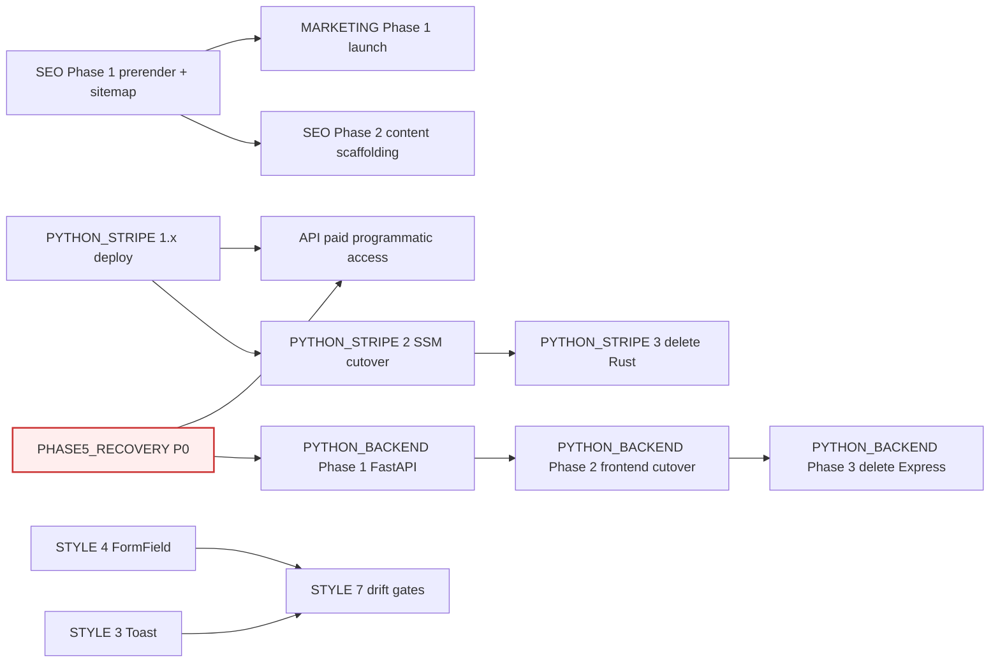
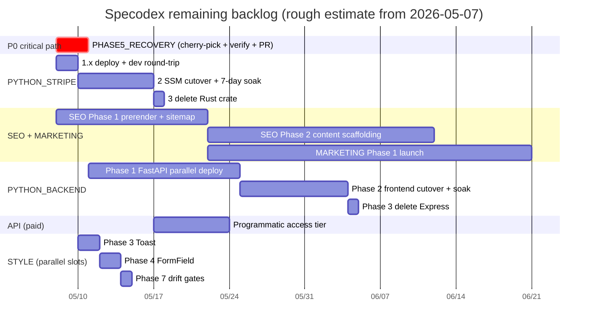

# Backlog

**This file is the entry point.** Reading this gets you the full picture
of what's left without opening each `todo/*.md`. Drill into the linked
docs only when you're about to act on that work.

> **Recently shipped (through 2026-05-07).** REBRAND, UNITS, INTEGRATION,
> FRONTEND_TESTING, CICD, the codegen toolchain (**MODELGEN Phase 0 +
> 0a-i + 0a-ii + 0b + 0c, end-to-end** — `models.ts` is now a re-export
> shim from `generated.ts`), Projects (per-user collections), **DEDUPE
> end-to-end** (Phase 1 audit + Phase 2 safe-merge + Phase 3 review-
> applier), data-quality observatory (`./Quickstart godmode`),
> `stripe_py/` Phase 1.1 layout, mobile-friendly compaction pass,
> **STYLE Phases 1 (Tooltip), 2 (ConfirmDialog), 5 (themed scrollbars),
> 6 (ExternalLink)** + CLAUDE.md "no native chrome" rule,
> **PYTHON_BACKEND Phase 5** (cli/ migration cleanup via deletion),
> auth Phases 1–4 + 5b WAF + 5d CSP/HSTS, **DB platform-harden**
> (IAM split, getCategories N+1 fix, prod deletion protection, Lambda
> Node 22, PITR), DB_CLEANUP (gearhead torque rename + electric_cylinder
> field drops + field-coverage audit CLI), filter-UX bug fixes
> (Tooltip ref-merging — column-header multi-select popovers were
> silently failing to anchor when wrapped in `<Tooltip>`; popover
> mode-before-selection — clicking exclude before any value picked was
> dropped) plus 19 new vitest cases covering the popover contract.
>
> **Just deleted from `todo/`** (2026-05-03 cleanup): AUTH.md, REFACTOR.md,
> VISUALIZATION.md, GODMODE.md — all four had their scope shipped or
> their action items operationalised into the surviving docs. Same
> pattern as the earlier deletions of REBRAND.md / UNITS.md /
> INTEGRATION.md / FRONTEND_TESTING.md — `git log --diff-filter=D --follow
> -- todo/<NAME>.md` recovers any design rationale.

## How to use it

1. **Starting a session?** Open the [Specodex Orchestration board](https://github.com/users/JimothyJohn/projects/1) — it's the source of truth for what's active, blocked, or queued. Skim **The bottleneck** here for any operator-only actions.
2. **About to touch a file?** Scan **Trigger conditions** at the bottom — if anything matches, the linked doc is queued and worth reading first.
3. **Got an idle dev box overnight?** Pick from **Late Night** — curated tasks safe to run autonomously and easy to verify in the morning.
4. **Deferring new work?** Add a `todo/<AREA>.md` with a `## Triggers` section, then create a card on the board referencing it. Add a row to **Trigger conditions** below if the doc has file-level triggers.

> **Board access (CLI).** `gh project item-list 1 --owner JimothyJohn --format json`. Requires the `project` scope on the gh token. Full access pattern + field IDs in the auto-memory `reference_orchestration_board.md`.

---

## The bottleneck — operator queue

Drained as of 2026-04-30. No operator-only actions outstanding.

---

## Working tree state

Snapshot 2026-05-07. **Stale within hours; re-run `git status` and
`git worktree list` for ground truth.**

`master` is clean. The redundant `specodex-csp` worktree was removed
on 2026-05-07. The only remaining drift is the **four stranded auth
Phase 5 worktrees** (`specodex-{ses,revoke,audit,alarms}`).

```
/Users/nick/github/specodex         master                              ← this one
/Users/nick/github/specodex-alarms  feat-auth-phase5f-alarms            (stranded)
/Users/nick/github/specodex-audit   feat-auth-phase5e-audit             (stranded)
/Users/nick/github/specodex-revoke  feat-auth-phase5c-revoke            (stranded)
/Users/nick/github/specodex-ses     feat-auth-phase5a-ses               (stranded)
```

[PHASE5_RECOVERY.md](PHASE5_RECOVERY.md) owns the cherry-pick recovery
plan for the four stranded phases.

---

## Active work

**Tracked on the [Specodex Orchestration board](https://github.com/users/JimothyJohn/projects/1).** Status, Priority, and Size live there now — this section is no longer the source of truth.

Each card body links back to its `todo/<AREA>.md` doc. To add new work, create a card on the board referencing the doc; if the work has file-level triggers, also add a row to **Trigger conditions** below.

Active docs (2026-05-07): PHASE5_RECOVERY (P0), SEO, MARKETING,
PYTHON_BACKEND (Phases 1–3 only), PYTHON_STRIPE, STYLE (Phases 3, 4, 7),
API. **Recently retired**: MODELGEN (end-to-end shipped) and DEDUPE
(Phases 1+2+3 shipped) — docs may be deleted in the next cleanup pass.

CI/CD itself is healthy (full chain green; only outstanding bit is apex
`specodex.com` DNS) and now lives behind the `/cicd` skill rather than
a `todo/*.md` plan — invoke the skill or read
`.claude/skills/cicd/SKILL.md` for the runbook + foot-gun list.

---

## Suggested chronological order

With UNITS, REBRAND, INTEGRATION, FRONTEND_TESTING, GODMODE, CICD,
**MODELGEN end-to-end**, and **DEDUPE end-to-end** all landed, the
remaining order:

1. **PHASE5_RECOVERY first.** It blocks PYTHON_BACKEND Phase 1 (FastAPI auth would mirror the wrong Cognito surface), it unblocks API.md (paid programmatic access depends on SES), and it's the highest-risk of the queue.
2. **PYTHON_STRIPE Phase 1 deploy + Phase 2 cutover.** Code is scaffolded; just needs deploy + soak. Independent of everything else, ship in any spare slot.
3. **SEO + MARKETING.** Public launch is now possible. SEO structural lifts pair with marketing distribution; product pages serve both.
4. **PYTHON_BACKEND Phase 1+** once everything above stops shifting. Don't start the FastAPI parallel-deploy on a moving target.
5. **STYLE** runs alongside in any spare slot. Phases 3 (Toast) and 4 (FormField) are next; Phase 7 (drift gates) closes the plan once the others ship.

**Out-of-band exceptions.** Urgent bugs, security issues, or user-visible breakage jump the queue.

---

## Parallelism & dependencies

**Hard blockers (must finish before dependent starts):**

- `PHASE5_RECOVERY` ⟶ `PYTHON_BACKEND Phase 1` (FastAPI auth would otherwise mirror the wrong Cognito surface)
- `PHASE5_RECOVERY` (5a SES specifically) ⟶ `API.md` (paid users need real receipt emails)
- `PYTHON_STRIPE 1.x deploy` ⟶ `API.md` (paid surface assumes the billing Lambda is live)
- `PYTHON_STRIPE 1.x deploy` ⟶ `PYTHON_STRIPE 2 cutover` ⟶ `PYTHON_STRIPE 3 delete Rust`
- `PYTHON_BACKEND Phase 1` ⟶ `Phase 2` ⟶ `Phase 3`
- `SEO Phase 1` ⟶ `MARKETING Phase 1` (Show HN with broken indexing wastes the shot)
- `STYLE Phases 3 + 4` ⟶ `STYLE Phase 7 (drift gates)`

**Soft sequencing (ergonomic, not technical):**

- `PYTHON_STRIPE Phase 3` (delete Rust) ⟶ `PYTHON_BACKEND Phase 4` is moot — the work is the same, do it once via PYTHON_STRIPE.
- STYLE Phases 3 (Toast) and 4 (FormField) both touch shared state — single-stream them, but they don't block any non-STYLE work.

**Truly independent (run in any spare slot, in parallel with anything):**

- `PYTHON_STRIPE 1.x deploy`
- `SEO Phase 1`
- `STYLE Phase 3 (Toast)` — closes ~25 silent failure paths in AppContext / DatasheetEditModal alert
- ~~`PYTHON_BACKEND Phase 5` (cli/migrations cleanup)~~ ✅ shipped 2026-04-30 (commit `c322393`)





> Bars are **rough estimates**, not commitments. The Gantt assumes a
> single engineer working serially within each section; parallel
> sections (MODELGEN ‖ PYTHON_STRIPE ‖ SEO ‖ DEDUPE ‖ STYLE) compress
> the wall-clock if there's bandwidth to fan out, but most of these
> still gate on Nick's review and merge.

---

## Late Night

Curated tasks safe to run autonomously overnight on dev. Each one meets four criteria:

- **Bounded** — known finish line (queue size, fixture list, model count)
- **Dev-only writes** — no infrastructure touch, no shared-state mutation, no prod
- **Recoverable** — failure leaves dev DB consistent or rolls back cleanly
- **Morning-checkable** — clear go/no-go signal in artifacts; if green, ship to prod via existing `./Quickstart admin promote` flow

### Tier 1 — read-only or local-only (zero cost)

| Task | Command | Output to check |
|---|---|---|
| Bench (offline) | `./Quickstart bench` | `outputs/benchmarks/<ts>.json` — diff precision/recall vs `latest.json` |
| Ingest-report | `./Quickstart ingest-report --email-template` | `outputs/ingest_report_*.md` — quality fails grouped by manufacturer |
| UNITS review triage | `./Quickstart units-triage outputs/units_migration_review_dev_*.md` (script lives on branch `late-night-units-triage`) | `outputs/units_triage_<stage>_<source-ts>_triaged_<run-ts>.md` — pattern groups + suggested action per group |
| Integration test sweep | `./Quickstart verify --integration` | exit code; stale tests surface as failures |
| DEDUPE audit (Phase 1) | `./Quickstart audit-dedupes --stage dev` — read-only on dev DB | `outputs/dedupe_audit_dev_<ts>.json` + `outputs/dedupe_review_dev_<ts>.md`. Phases 2 (`--apply --safe-only`) and 3 (`--apply --from-review`) shipped 2026-05-07 — both write to dev only. |
| Field-coverage audit | `uv run python -m cli.audit_fields --stage dev` | `outputs/audit_fields_dev_<ts>.md` — drives `todo/DB_CLEANUP.md` Phase 2+ |

### Tier 2 — small Gemini cost, dev DB writes only

| Task | Command | Cost | Output to check |
|---|---|---|---|
| Schemagen on stockpiled PDFs | `./Quickstart schemagen <pdf>... --type <name>` | ~$0.10–0.50/PDF | `<type>.py` + `<type>.md` (ADR) per cluster |
| Price-enrich (dev) | `./Quickstart price-enrich --stage dev` | scraping + occasional Gemini | DynamoDB row counts before/after; spot-check 5–10 enriched rows in UI |

### Tier 3 — bounded but expensive (run weekly, not nightly)

| Task | Command | Cost | Output to check |
|---|---|---|---|
| Bench (live) | `./Quickstart bench --live --update-cache` | ~$1–5/run | precision/recall delta + cache delta — catches LLM-pipeline drift offline-bench can't see |
| Process upload queue | `./Quickstart process --stage dev` | unbounded — only run if queue size is known | products created in dev; smoke-check via `/api/v1/search` |

### Morning checklist (before promoting)

1. **Logs.** `tail -100 .logs/*.log` — no unhandled exceptions, no rate-limit spirals.
2. **Bench delta.** `diff outputs/benchmarks/latest.json outputs/benchmarks/<ts>.json` (or `jq` the precision/recall fields). Drop > 5pp on any fixture is a stop signal.
3. **Endpoint shape.** Hit dev `/health`, `/api/products/categories`, `/api/v1/search?type=motor&limit=5`. All should 200 with expected shape per CLAUDE.md "canonical endpoints".
4. **Newly-proposed types.** If schemagen ran: read each `<type>.md` ADR. Reject anything that hardcodes one vendor's quirks.
5. **DB sample.** UI walkthrough on http://localhost:5173: pick the new type, confirm filter chips + table columns render. Spot-check 5–10 newly-written / enriched rows.
6. **If green:** `./Quickstart admin promote --stage staging --since <ts>`, smoke staging, then `--stage prod`.
7. **If red or surprising:** damage is dev-only. `./Quickstart admin purge --stage dev --since <ts>` rolls back, then triage.

### Not Late Night material

- Anything touching `app/infrastructure/` (CDK) or `.github/workflows/` — needs human review.
- Any prod write or `./Quickstart admin promote --stage prod` — gated on morning checklist.
- SEO structural lifts (per-product page rendering, dynamic sitemap) — needs build + manual crawl check.

---

## Trigger conditions — when to surface which doc

If your current task matches any "trigger" entry, the linked doc is queued and worth raising before you go further. When multiple match, mention all. Surfacing once is cheap; silently shipping work that conflicts with a deferred plan is expensive.

| Trigger (files / topics in your current task) | Surface |
|---|---|
| `app/frontend/index.html` head metadata, `app/frontend/public/{robots.txt,sitemap.xml}`, JSON-LD blocks, OG/Twitter card tags, per-product page rendering, dynamic sitemap, prerender/SSR, "SEO", "canonical", "search ranking", "OG image" | [SEO.md](SEO.md) |
| Landing-page copy, "marketing", "launch", "audience", "Reddit / HN / mailing list", outreach plans, paid spend (don't), Stripe pricing surface | [MARKETING.md](MARKETING.md) |
| `cli/growth.py`, `specodex/growth/`, "growth CLI", "engagement footprint", "Google Ads", "Meta Marketing", "LinkedIn Ads", "feedback loop on traffic", Search Console / GitHub traffic / CloudFront logs into a weekly report | [GROWTH_CLI.md](GROWTH_CLI.md) |
| `.github/workflows/`, `cli/quickstart.py`, push to master, deploy attempt, "CI red", `HOSTED_ZONE_ID`/`HOSTED_ZONE_NAME`/`DOMAIN_NAME`/`CERTIFICATE_ARN`, `gh-deploy-datasheetminer`, OIDC trust policy, apex/`www` domain support, `app/infrastructure/lib/config.ts:hostedZoneName` fallback | `/cicd` skill (`.claude/skills/cicd/SKILL.md`) |
| `cli/admin.py:purge`/`promote`, `specodex/ids.py:compute_product_id` or `_strip_family_prefix`, new vendor catalog with prefix-form drift; user mentions "duplicate", "dedupe", "merge rows", "same product twice", "two part numbers for one motor"; promotion to staging/prod | [DEDUPE.md](DEDUPE.md) |
| `app/infrastructure/lib/auth/auth-stack.ts`, `app/backend/src/routes/auth.ts` (audit), Cognito SES sender, refresh-token revocation, WAF CloudWatch alarms; `gh pr list` showing PR #3/#5/#7/#8 as merged; the `specodex-{ses,revoke,audit,alarms}` worktrees | [PHASE5_RECOVERY.md](PHASE5_RECOVERY.md) |
| `specodex/models/*.py`, `specodex/models/common.py:ProductType`, `app/frontend/src/types/{models,generated}.ts`, `app/backend/src/routes/search.ts` zod enum, `app/backend/src/config/productTypes.ts`, `scripts/gen_types.py`, `./Quickstart gen-types`, "pydantic2ts", "generated.ts", "drift", "add product type" | [MODELGEN.md](MODELGEN.md) |
| `app/backend/src/` beyond a bug fix, new endpoint, new middleware, "FastAPI", "Mangum", "rewrite Express in Python" | [PYTHON_BACKEND.md](PYTHON_BACKEND.md) |
| `stripe/` (Rust source), `stripe_py/` (Python port), Stripe webhook handler, `${ssmPrefix}/stripe-lambda-url`, billing Lambda deploy or cutover | [PYTHON_STRIPE.md](PYTHON_STRIPE.md) |
| Programmatic API access, long-lived API keys, per-key rate limits, `/api/v1/*` from non-SPA callers, paid Stripe surface activation | [API.md](API.md) |
| New JSX with `title=`, `window.confirm`, `alert(`, `<form>` without `noValidate`, bare `target="_blank"`, `<input type="checkbox">` without `appearance: none`, raw `overflow: auto/scroll` in CSS; any user-triggered `console.error` without a paired toast; reaching for `<select>`/`<input type="file">`/`<dialog>`/`<details>` | [STYLE.md](STYLE.md) |
