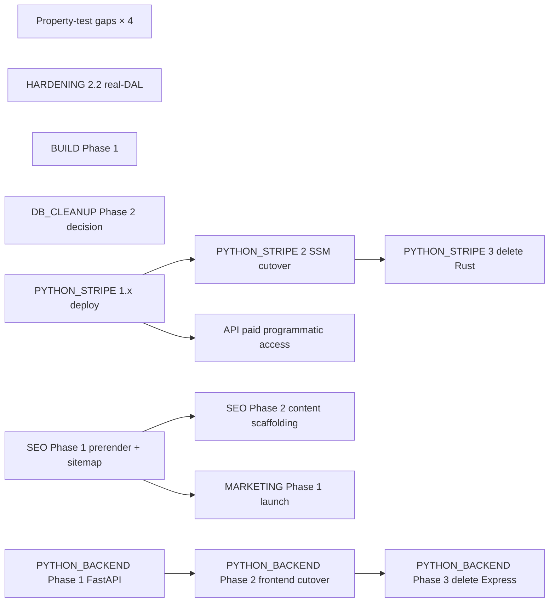

# Backlog

**This file is the entry point.** Reading this gets you the full picture
of what's left without opening each `todo/*.md`. Drill into the linked
docs only when you're about to act on that work.

> **Recently shipped (2026-05-14 sprint — closed out the property-test gaps).**
> The four "untested adversarial surfaces" called out in CLAUDE.md's
> 2026-05-10 Property-testing section are now all covered:
> `cli/processor.py:parse_datasheet_id_from_key` (PR #149,
> 2026-05-11), `specodex/integration/compat.py` helpers (PR #185,
> 2026-05-13), `specodex/spec_rules.py:validate_product` (PR #202,
> this sprint), and `specodex/quality.py:score_product` +
> `filter_products` (PR #203, this sprint). None of the four runs
> surfaced new bugs — Hypothesis confirmed the contract the example
> tests had pinned. Two non-bug findings worth documenting: RobotArm
> and Gearhead both ship with substantial Pydantic field defaults
> (`degrees_of_freedom=6`, `ip_rating=54`, `gear_type='helical
> planetary'`, `lubrication_type='Synthetic Lubricant'`) that
> pre-populate enough spec fields to clear the 25% quality
> threshold — scoped the threshold-baseline property to Motor +
> Drive rather than chase the defaults.
>
> **Recently shipped (2026-05-11 → 2026-05-13 — BAUHAUS port wave).**
> The full 10-phase Bauhaus design refresh planned in
> [BAUHAUS.md](BAUHAUS.md) shipped end-to-end across ~40 PRs (#150
> through #197): page-toolbar (#170), collapsible stat row (#171),
> catalog table (#172), column-header section + sort + slider visuals
> + perf (#173/#174/#175/#176/#177/#178/#179), filter rail
> (#162) + filter chips (#161), modals (#164/#165/#182/#183),
> BuildPage (#186), AdminPanel + DatasheetsPage + ProductManagement
> (#188/#189/#190), and the seven-phase `!important` cluster sweep
> (#192/#193/#194/#195/#196/#197). The slider "continuous-value"
> interpretation (#180) was reverted (#181) — the actual intent was
> never identified. Phase status lives in
> [BAUHAUS_FOLLOWUP.md](BAUHAUS_FOLLOWUP.md).
>
> **Also shipped 2026-05-11 → 2026-05-13:** weekly DB drift audit
> workflow (#152/#168), batch-drives runner + 12 vendor target
> lists (5,294 drives ingested, #199), `React.memo` perf passes
> on the column header (#198) + page-render (#200), CI dev-branch
> staging deploy trigger (#191), and the gear-ratio always-on
> column on motor view (#201). Smoke retry on transient AWS edge
> deny (#169).
>
> **Recently shipped (2026-05-10 sprint — 21 PRs in one day).**
> All of HARDENING Phase 3.1 (parse_gemini_response, common.py
> BeforeValidators, find_spec_pages_by_text), Phase 3.3 (schema
> forward/backward compat tests with frozen JSON snapshots per
> ProductType), Phase 3.4 (concurrent-write stress test via moto +
> ThreadPoolExecutor), the property-test sweep over encoder/drive
> coercers, gearhead falsy-value coerce, the validate_url SSRF
> defense, merge_per_page_products, and the double_tap verifier.
> Plus **SCHEMA Phase 4** (kg → kgf → N Force coercion via per-family
> pre_rewrite on UnitFamily), **SCHEMA Phase 2** (motor_mount_pattern
> backfill CLI, dry-run default), the **CodeQL #66 cleanup** (dead
> `_CANONICAL_DEVICES` global), the **test_resilience.py de-flake**
> (module autouse wait + lru_cache patch), a CLAUDE.md "Property
> testing — adversarial by default" conventions section, and 3
> docs-syncs of per-PR HTML pages.
>
> **Three real bugs caught and fixed by Hypothesis this sprint:**
> (1) `_coerce_ip_rating` returned `list`/`tuple`/`float` inputs
> unchanged instead of `None`; bool inputs slipped through
> `isinstance(v, int)` and became IP ratings 1/0 — fixed in PR #112.
> (2) `_coerce_protocol_list([""])` returned `[""]` instead of
> `["unknown"]`, killing Drive rows via the `Literal[EncoderProtocol]`
> validator — fixed in PR #116. (3) `Gearhead.coerce_string_fields`
> leaked Python dict-repr (`"{'value': 0, 'unit': 'mm'}"`, `"{}"`)
> for falsy values — fixed in PR #118. Each was a bug where the
> docstring said one thing and the code did another; the property
> test pinned the documented contract and the code revealed itself.
>
> **Earlier (2026-05-09 → 2026-05-10):** SCHEMA Phase 1 (PR #87),
> SCHEMA Phase 3 end-to-end (PRs #89/#90/#92), DOUBLE_TAP end-to-end
> (PR #91), BUILD scaffold (PR #94), categorical DistributionChart
> in ColumnHeader (PR #88), recovered design docs (PR #85),
> linear-actuator type discoverability (PR #86), and HARDENING
> Phase 1+2+4 sweep (PRs #95/#97/#98/#100/#101/#103/#102) plus
> quickstart npm-ci correctness fix (#99) and lockfile Node 20
> regen (#96).
>
> **Earlier (through 2026-05-08).** REBRAND, UNITS, INTEGRATION,
> FRONTEND_TESTING, CICD, the codegen toolchain (MODELGEN Phase 0 +
> 0a-i + 0a-ii + 0b + 0c, end-to-end), Projects (per-user
> collections), DEDUPE end-to-end (Phase 1 audit + Phase 2 safe-merge
> + Phase 3 review-applier), data-quality observatory
> (`./Quickstart godmode`), `stripe_py/` Phase 1.1 layout,
> mobile-friendly compaction pass, STYLE Phases 1–7.1 end-to-end +
> CLAUDE.md "no native chrome" rule (todo/STYLE.md retired),
> PYTHON_BACKEND Phase 5, auth Phases 1–4 + 5b WAF + 5d CSP/HSTS,
> DB platform-harden, DB_CLEANUP (gearhead torque rename +
> electric_cylinder field drops + audit CLI), filter-UX bug fixes,
> and a 2026-05-08 dev → prod promotion of 1,657 records.
>
> **Just deleted from `todo/`** (2026-05-10 post-sprint prune):
> DOUBLE_TAP.md (scope fully shipped via PR #91 — encoder model
> + verifier loop are the live reference now), CATAGORIES.md
> (Phase 0+1 shipped via #85/#87, Phase 2+ unscoped),
> BOARD_FEEDBACK.md (items 1–3 shipped, 4–9 are founder-driven not
> Claude-actionable), SCHEMA.md (4 of 5 phases shipped — extracted
> the remaining BREAKING Phase 1.1 design into the much smaller
> [SCHEMA_BREAKING_HARMONIZE.md](SCHEMA_BREAKING_HARMONIZE.md)).
> Plus **moved to `todo/longterm/`**: CONFIGURATION.md (deferred,
> gated on ≥ 2-week MVP soak) and GROWTH_CLI.md (no active plan
> in churn). DOUBLE_TAP_encoder_taxonomy.md **moved** to
> `specodex/models/encoder_taxonomy.md` next to the code that uses
> it.
>
> **Earlier deletions:** 2026-05-08 cleanup retired MODELGEN.md,
> DEDUPE.md, PHASE5_RECOVERY.md. 2026-05-03 cleanup retired
> AUTH.md, REFACTOR.md, VISUALIZATION.md, GODMODE.md. Before that:
> REBRAND.md, UNITS.md, INTEGRATION.md, FRONTEND_TESTING.md.
> `git log --diff-filter=D --follow -- todo/<NAME>.md` recovers
> any design rationale.

## How to use it

1. **Starting a session?** Skim the **churn plan** table at the bottom of this file (or the kanban at [docs/roadmap.html](../docs/roadmap.html)). One row = one PR; status emoji says whether it's ready, queued, or blocked.
2. **About to touch a file?** Scan **Trigger conditions** at the bottom — if anything matches, the linked doc is queued and worth reading first.
3. **Got an idle dev box overnight?** Pick from **Late Night** — curated tasks safe to run autonomously and easy to verify in the morning.
4. **Deferring new work?** Add a `todo/<AREA>.md` with a `## Triggers` section. Add a row to **Trigger conditions** below if the doc has file-level triggers. Re-run `uv run python scripts/gen_roadmap.py` to refresh the kanban.

> **No GitHub Project board.** The Specodex Orchestration GH Project was deleted 2026-05-13 — it was duplicating this file and nobody was using it. Source of truth is `todo/` (this file + per-area docs); the kanban at `docs/roadmap.html` is a generated mirror.

---

## Working tree state

Snapshot 2026-05-14 (end of the property-test gap closeout
sprint). **Stale within hours; re-run `git status` and
`git worktree list` for ground truth.**

Master is at the post-PR-#201 cohort (gear-ratio always-on column).
Open from this sprint: **#202** (`spec_rules.validate_product`
property tests, draft + CI-green) and **#203**
(`quality.score_product` property tests, draft + CI-green).

The five side-worktrees from the 2026-05-10 sprint are all stale —
their branches merged or were superseded by master. Run
`git worktree list` for ground truth and `git worktree remove
<path>` to prune.

---

## Active work

Status lives in two places now: the **churn plan** table further down this file (one row per PR, with a status emoji), and the generated kanban at [docs/roadmap.html](../docs/roadmap.html) (a mirror of the same data, easier to skim).

To add new work, drop a `todo/<AREA>.md` with the standard structure (H1 title, status blockquote, phased plan, optional `## Triggers` section); if the work has file-level triggers, add a row to **Trigger conditions** below. Re-run `uv run python scripts/gen_roadmap.py` to refresh the kanban.

Active docs (11 total — BAUHAUS.md added 2026-05-12):

- **BAUHAUS.md** — 10-phase UI refresh port from
  `docs/design/bauhaus-catalog.html`. Phases 2–10 shipped end-to-end
  across the 2026-05-11 → 2026-05-13 window. **Open:** the deferred
  `!important` cluster refactor and a couple of unsettled visual
  threads tracked in [BAUHAUS_FOLLOWUP.md](BAUHAUS_FOLLOWUP.md)
  (filter-chip internals, slider "fine resolution" interpretation).
- **HARDENING.md** — adversarial-by-default posture audit. 10 of 14
  phases shipped (1.1, 1.3, 2.1, 2.3, 2.4, 3.1×3, 3.3, 3.4, 4.1, 4.3).
  The 2026-05-14 sprint closed out the four "untested adversarial
  surfaces" (`cli/processor.py`, `compat.py`, `spec_rules.py`,
  `quality.py`) via PRs #149/#185/#202/#203. **Open:** Phase 1.2
  (`uv sync --locked` CI sweep), 2.2 (real-DAL backend tests, L),
  3.2 (atheris fuzz), 4.2 (lockfile-drift CI gate). 1.2 + 4.2 touch
  `.github/workflows/` so they're skip-list for autonomous sprints.
- **SCHEMA_BREAKING_HARMONIZE.md** — what's left of the SCHEMA plan.
  Phases 1, 2 (CLI), 3, 4 all shipped; only the BREAKING type-
  harmonisation (`motor_type` → `MotorTechnology` literal +
  `ElectricCylinder.fieldbus` → `List[CommunicationProtocol]`) is
  deferred. **Needs sign-off** before applying — reshapes JSON
  envelope on existing DB rows.
- **BUILD.md** — requirements-first system assembler page that
  generalises `/actuators`. **Design-only.** Hard prereqs (SCHEMA
  Phase 3 ✓, linear_actuator discoverability ✓) both shipped.
  Phase 1 implementation is the first user-facing work in the
  next-sprint queue.
- **DB_CLEANUP.md** — Phase 1 shipped. Phase 2 (populate vs drop
  `lead_time` / `warranty` / `msrp`) **needs a decision** — the
  field-coverage audit recommends dropping; the original framing
  said populate. Re-decide before implementing.
- **SEO.md**, **MARKETING.md** — public-launch readiness.
- **PYTHON_BACKEND.md** — **Phase 1 code-complete** (2026-05-15
  sprint, PRs #205–#215). The entire FastAPI backend
  (`app/backend_py/`) is ported + tested: auth middleware, all 11
  Express routes, CDK `/api/v2` wiring (draft PR #212), the
  `VITE_API_VERSION` switch. **Open:** deploy v2 (operator —
  `./Quickstart build-backend-py` + `cdk deploy`), Phase 2 cutover
  (flip `VITE_API_VERSION=v2`), Phase 3 (delete Express once v2 is
  healthy). All operator-driven; no code left.
- **PYTHON_STRIPE.md** (Phases 1.x → 2 → 3) — billing Lambda deploy
  + SSM cutover + Rust crate retirement. Code scaffolded; needs the
  operator-driven deploy.
- **API.md** — paid programmatic-access tier. Depends on
  PYTHON_STRIPE Phase 2 cutover (billing live).

`longterm/` (deferred, not in current churn): `BOARD.md` (board
strategy doc), `CONFIGURATION.md` (post-MVP architecture rethink,
gated on ≥ 2-week MVP soak), `GROWTH_CLI.md` (engagement-footprint
reporting, no active plan).

`encoder_taxonomy.md` lives at `specodex/models/encoder_taxonomy.md`
now (next to the code that uses it), not under `todo/`.

`todo/STYLE.md` retired 2026-05-08 — all seven STYLE phases shipped.
`todo/DOUBLE_TAP.md`, `todo/CATAGORIES.md`, `todo/BOARD_FEEDBACK.md`
retired 2026-05-10 — scope shipped (or in BOARD_FEEDBACK's case,
items 4–9 are founder-driven, not a planning artifact).

CI/CD itself is healthy (full chain green; only outstanding bit is
apex `specodex.com` DNS) and now lives behind the `/cicd` skill
rather than a `todo/*.md` plan.

---

## Suggested chronological order

The 2026-05-10 sprint cleared most of the previously-named queue.
The remaining order, ranked by leverage / unblocked-ness:

1. **Property-test gap coverage** — the four surfaces called out in
   CLAUDE.md's new "Property testing" section: `cli/processor.py`
   (upload-queue dispatch + S3 key parsing), `specodex/integration/compat.py`
   (`_scalar` / `_range` / `_check_*`), `specodex/spec_rules.py:validate_product`
   (magnitude rules), `specodex/quality.py:score_product` (quality
   scoring). Each is one small clean PR, follows the established
   pattern from this sprint, and is the high-probability ground for
   finding bug #4.
2. **HARDENING Phase 2.2** (backend real-DAL integration tests).
   Large but code-only; the existing mocked-table tests don't
   catch DynamoDB-specific bugs.
3. **BUILD Phase 1** — requirements-first Build page. Now
   unblocked, first user-facing work in the queue. Higher impact
   than another property test if the next sprint wants something
   visible.
4. **SCHEMA Phase 2 *execution*** — operator runs the
   `./Quickstart admin -- backfill-motor-mounts --stage dev --apply`
   on dev, verifies, then promotes. The script is shipped (PR #117);
   running it is one operator action.
5. **DB_CLEANUP Phase 2 decision** — the field-coverage audit's
   recommendation conflicts with the README's previous framing.
   Decide whether to populate or drop `lead_time` / `warranty` /
   `msrp` before implementing either.
6. **PYTHON_STRIPE 1.x deploy → 2 cutover → 3 delete Rust crate.**
   Operator-driven deploy chain.
7. **SEO Phase 1** — prerender + sitemap + per-product page
   rendering. Multi-day structural work but the marketing prereq.
8. **MARKETING Phase 1** — Show HN + Reddit + GitHub README polish.
   Don't do this until SEO Phase 1 lands (Show HN with broken
   indexing wastes the shot).
9. **PYTHON_BACKEND Phase 1** — FastAPI parallel deploy. Don't
   start on a moving target; do this once the above stops shifting.
10. **HARDENING Phase 2.2 / 3.2 / 4.2 / 1.2** — the remaining
    HARDENING items. 1.2 + 4.2 touch `.github/workflows/` so
    they're skip-list for autonomous sprints; 2.2 + 3.2 are
    code-only but heavier than the Phase 3.1 wins.

**Out-of-band exceptions.** Urgent bugs, security issues, or
user-visible breakage jump the queue.

---

## The churn plan — PRs in order for the next sprint

Each row is one reviewable PR. We churn through these
top-to-bottom, **one at a time, with Nick's permission per PR**.
Every PR ships with a per-PR HTML doc in `docs/requests/<n>.html`
(see CLAUDE.md "Per-PR documentation pages").

| # | PR scope | Doc | Status |
|---|---|---|---|
| 1 | **Property tests — `cli/processor.py` upload-queue dispatch + S3 key parsing** | HARDENING | ✅ shipped #149 |
| 2 | **Property tests — `specodex/integration/compat.py` (`_scalar` / `_range` / `_check_*`)** | HARDENING | ✅ shipped #185 |
| 3 | **Property tests — `specodex/spec_rules.py:validate_product` magnitude rules** | HARDENING | ✅ shipped #202 |
| 4 | **Property tests — `specodex/quality.py:score_product`** | HARDENING | ✅ shipped #203 |
| 5 | **HARDENING Phase 2.2** — real-DAL backend integration tests (L) | HARDENING | ⚪ queued (next-sprint top) |
| 6 | **BUILD Phase 1** — requirements-first Build page (motion/stroke/speed/payload/orientation form → motion-system kit) | BUILD | ⚪ queued (independent, user-facing) |
| 7 | **DB_CLEANUP Phase 2 decision** — populate vs drop `lead_time` / `warranty` / `msrp` (audit says drop; README says populate) | DB_CLEANUP | 🔴 needs sign-off |
| 8 | **SCHEMA BREAKING harmonize** — `motor_type` → `MotorTechnology` literal + `ElectricCylinder.fieldbus` → `List[CommunicationProtocol]` + harmonize CLI. See [SCHEMA_BREAKING_HARMONIZE.md](SCHEMA_BREAKING_HARMONIZE.md). | SCHEMA_BREAKING_HARMONIZE | 🔴 needs sign-off |
| 9 | **PYTHON_STRIPE Phase 1.x deploy** — billing Lambda goes live on dev, dev round-trip, soak | PYTHON_STRIPE | ⚪ queued (operator-driven deploy) |
| 10 | **PYTHON_STRIPE Phase 2** — SSM cutover + 7-day soak | PYTHON_STRIPE | ⚪ queued |
| 11 | **PYTHON_STRIPE Phase 3** — delete Rust crate (subsumes PYTHON_BACKEND Phase 4) | PYTHON_STRIPE | ⚪ queued |
| 12 | **SEO Phase 1** — prerender + sitemap + per-product page rendering | SEO | ⚪ queued (multi-day, needs human PR for build config) |
| 13 | **SEO Phase 2** — content scaffolding | SEO | ⚪ queued |
| 14 | **MARKETING Phase 1** — public launch (Show HN, mailing list) | MARKETING | ⚪ queued |
| 15 | **PYTHON_BACKEND Phase 1** — FastAPI backend code-complete (PRs #205–#215); v2 deploy is operator-driven (`./Quickstart build-backend-py` + `cdk deploy`, CDK draft #212) | PYTHON_BACKEND | ✅ code shipped / 🔴 deploy = operator |
| 16 | **PYTHON_BACKEND Phase 2** — frontend cutover (flip `VITE_API_VERSION=v2`, redeploy) | PYTHON_BACKEND | 🔴 operator-driven (needs v2 deployed first) |
| 17 | **PYTHON_BACKEND Phase 3** — delete Express (retires `app/backend/src/types/models.ts` hand-edit) | PYTHON_BACKEND | 🔴 blocked on Phase 2 cutover |
| 18 | **API.md** — paid programmatic access tier (depends on Stripe Phase 2 cutover + SES) | API | ⚪ queued |
| 19 | **HARDENING Phase 3.2** — atheris fuzz target for PDF intake | HARDENING | ⚪ queued (heavier dep — needs LLVM/clang on macOS) |
| 20 | **HARDENING Phase 1.2** — `uv sync --locked` sweep across CI workflows | HARDENING | ⚪ queued (touches `.github/workflows/` — needs human PR) |
| 21 | **HARDENING Phase 4.2** — lockfile-drift gate post-install | HARDENING | ⚪ queued (touches CI — needs human PR) |

**Status legend.** 🟡 = ready to PR now. ⚪ = queued, no blockers
beyond the row above. 🔴 = blocked on explicit human sign-off. ⏸ =
deliberately deferred.

**One PR at a time.** Don't open #2 until #1 is merged. Don't
speculatively branch ahead of the queue — context shifts as PRs
land.

---

## Parallelism & dependencies

**Hard blockers (must finish before dependent starts):**

- `SCHEMA Phase 2 execution (operator)` ⟶ promote `motor_mount_pattern` to staging/prod
- `PYTHON_STRIPE 1.x deploy` ⟶ `API.md` (paid surface assumes billing Lambda is live)
- `PYTHON_STRIPE 1.x deploy` ⟶ `PYTHON_STRIPE 2 cutover` ⟶ `PYTHON_STRIPE 3 delete Rust`
- `PYTHON_BACKEND Phase 1` ⟶ `Phase 2` ⟶ `Phase 3`
- `SEO Phase 1` ⟶ `MARKETING Phase 1` (Show HN with broken indexing wastes the shot)

**Truly independent (run in any spare slot, in parallel with anything):**

- Property-test gap coverage rows (#1–#4) — code-only, no shared state.
- `BUILD Phase 1` — frontend feature, independent of all backend rows.
- `GROWTH_CLI Phase 1` — independent reporting CLI.
- `HARDENING Phase 2.2 / 3.2` — code-only adversarial coverage.

---

## Late Night

Curated tasks safe to run autonomously overnight on dev. Each one meets four criteria:

- **Bounded** — known finish line (queue size, fixture list, model count)
- **Dev-only writes** — no infrastructure touch, no shared-state mutation, no prod
- **Recoverable** — failure leaves dev DB consistent or rolls back cleanly
- **Morning-checkable** — clear go/no-go signal in artifacts

### Tier 1 — read-only or local-only (zero cost)

| Task | Command | Output to check |
|---|---|---|
| Bench (offline) | `./Quickstart bench` | `outputs/benchmarks/<ts>.json` — diff precision/recall vs `latest.json` |
| Ingest-report | `./Quickstart ingest-report --email-template` | `outputs/ingest_report_*.md` — quality fails grouped by manufacturer |
| Integration test sweep | `./Quickstart verify --integration` | exit code; stale tests surface as failures |
| DEDUPE audit (Phase 1) | `./Quickstart audit-dedupes --stage dev` | `outputs/dedupe_audit_dev_<ts>.json` |
| Field-coverage audit | `uv run python -m cli.audit_fields --stage dev` | `outputs/audit_fields_dev_<ts>.md` |
| Motor-mount backfill **dry-run** | `./Quickstart admin -- backfill-motor-mounts --stage dev` | summary + sample mappings (no writes) |

### Tier 2 — small Gemini cost, dev DB writes only

| Task | Command | Cost | Output to check |
|---|---|---|---|
| Schemagen on stockpiled PDFs | `./Quickstart schemagen <pdf>... --type <name>` | ~$0.10–0.50/PDF | `<type>.py` + `<type>.md` (ADR) per cluster |
| Price-enrich (dev) | `./Quickstart price-enrich --stage dev` | scraping + occasional Gemini | DynamoDB row counts before/after |
| Motor-mount backfill **apply** | `./Quickstart admin -- backfill-motor-mounts --stage dev --apply` | none (DynamoDB writes only) | success/failure counts + before/after row sample |

### Tier 3 — bounded but expensive (run weekly, not nightly)

| Task | Command | Cost | Output to check |
|---|---|---|---|
| Bench (live) | `./Quickstart bench --live --update-cache` | ~$1–5/run | precision/recall delta + cache delta |
| Process upload queue | `./Quickstart process --stage dev` | unbounded — only run if queue size is known | products created in dev; smoke-check via `/api/v1/search` |

### Morning checklist (before promoting)

1. **Logs.** `tail -100 .logs/*.log` — no unhandled exceptions, no rate-limit spirals.
2. **Bench delta.** `diff outputs/benchmarks/latest.json outputs/benchmarks/<ts>.json`. Drop > 5pp on any fixture is a stop signal.
3. **Endpoint shape.** Hit dev `/health`, `/api/products/categories`, `/api/v1/search?type=motor&limit=5`. All should 200 with expected shape per CLAUDE.md "canonical endpoints".
4. **DB sample.** UI walkthrough on http://localhost:5173: pick a product type, confirm filter chips + table columns render.
5. **If green:** `./Quickstart admin promote --stage staging --since <ts>`, smoke staging, then `--stage prod`.
6. **If red or surprising:** damage is dev-only. `./Quickstart admin purge --stage dev --since <ts>` rolls back, then triage.

### Not Late Night material

- Anything touching `app/infrastructure/` (CDK) or `.github/workflows/` — needs human review.
- Any prod write or `./Quickstart admin promote --stage prod` — gated on morning checklist.
- SEO structural lifts (per-product page rendering, dynamic sitemap) — needs build + manual crawl check.

---

## Trigger conditions — when to surface which doc

If your current task matches any "trigger" entry, the linked doc is queued and worth raising before you go further. When multiple match, mention all.

| Trigger (files / topics in your current task) | Surface |
|---|---|
| New parser, deserializer, coercer, or `BeforeValidator`; CodeQL log-injection or input-handling finding; user asks "fuzz", "property test", "input validation" | [HARDENING.md](HARDENING.md) + CLAUDE.md "Property testing — adversarial by default" |
| `cli/processor.py`, `specodex/integration/compat.py`, `specodex/spec_rules.py`, `specodex/quality.py` | Property tests shipped (PRs #149/#185/#202/#203). Treat the existing `test_<name>_property.py` files as the contract; new edits to these modules should keep those properties green |
| `app/frontend/src/App.css`, design tokens (`--paper`, `--ink`, `--brass`, `--rule-*`, `--z-*`), Oswald/Plex Mono cascade, `.filter-chip-*`, `.column-header-*`, modal patterns, `!important` clusters; user asks "Bauhaus", "design refresh", "stencil headline", "manila", "field manual" | [BAUHAUS.md](BAUHAUS.md) — 10-phase port, [BAUHAUS_FOLLOWUP.md](BAUHAUS_FOLLOWUP.md) for what's still soft |
| Touching `Motor.type`, `ElectricCylinder.motor_type`, `LinearActuator.motor_type`, or `ElectricCylinder.fieldbus`; user asks "harmonize motor types", "MotorTechnology literal", "BREAKING schema migration" | [SCHEMA_BREAKING_HARMONIZE.md](SCHEMA_BREAKING_HARMONIZE.md) — needs sign-off |
| `specodex/models/common.py` (`MotorMountPattern`, `ProductType`), cross-product fields on motor/drive/gearhead/actuator; user asks "compatible motor", "matching drive", "device pairing", "integration" | SCHEMA — Phase 1, 2 (CLI), 3, 4 all shipped (PRs #87, #117, #89/#90/#92, #106). Recover the design rationale via `git log --diff-filter=D --follow -- todo/SCHEMA.md` if needed |
| `app/frontend/src/components/Build*.tsx`, `/build` route, requirements form, system-assembler page; user asks "build page", "requirements-first", "motion class", "system assembler", "wizard" | [BUILD.md](BUILD.md) — Phase 1 unblocked |
| `specodex/models/encoder.py`, `EncoderDevice` / `EncoderProtocol` enums, structured `EncoderFeedback`, verifier-loop runner, bench A/B harness; user asks "encoder taxonomy", "verifier loop", "second-pass extraction", "encoder compat" | `specodex/models/encoder_taxonomy.md` — taxonomy reference next to the code. The DOUBLE_TAP plan-doc was retired; scope shipped via PR #91. |
| `app/frontend/src/types/{categories,configuratorTemplates}.ts`, `app/frontend/src/components/ActuatorPage.tsx`; user asks "supercategory", "subcategory", "actuator landing page", "configurator template", "synthesise part number" | CATAGORIES — Phase 0+1 shipped (PRs #85/#87/#94). Phase 2+ unscoped; recover the design rationale via `git log --diff-filter=D --follow -- todo/CATAGORIES.md` |
| `app/frontend/index.html` head metadata, `app/frontend/public/{robots.txt,sitemap.xml}`, JSON-LD blocks, OG/Twitter card tags, per-product page rendering, dynamic sitemap, prerender/SSR, "SEO", "canonical", "search ranking", "OG image" | [SEO.md](SEO.md) |
| Landing-page copy, "marketing", "launch", "audience", "Reddit / HN / mailing list", outreach plans, paid spend (don't), Stripe pricing surface | [MARKETING.md](MARKETING.md) |
| `cli/growth.py`, `specodex/growth/`, "growth CLI", "engagement footprint", "Google Ads", "Meta Marketing", "LinkedIn Ads", Search Console / GitHub traffic / CloudFront logs into a weekly report | [longterm/GROWTH_CLI.md](longterm/GROWTH_CLI.md) — design-only, deferred |
| Configurator template architecture beyond `/actuators` MVP; user asks about declarative YAML templates, derivation graph, cross-device compat | [longterm/CONFIGURATION.md](longterm/CONFIGURATION.md) — gated on ≥ 2-week MVP soak |
| `.github/workflows/`, `cli/quickstart.py`, push to master, deploy attempt, "CI red", `HOSTED_ZONE_ID`/`HOSTED_ZONE_NAME`/`DOMAIN_NAME`/`CERTIFICATE_ARN`, `gh-deploy-datasheetminer`, OIDC trust policy, apex/`www` domain support | `/cicd` skill (`.claude/skills/cicd/SKILL.md`) |
| `app/backend/src/` beyond a bug fix, new endpoint, new middleware, "FastAPI", "Mangum", "rewrite Express in Python" | [PYTHON_BACKEND.md](PYTHON_BACKEND.md) |
| `stripe/` (Rust source), `stripe_py/` (Python port), Stripe webhook handler, `${ssmPrefix}/stripe-lambda-url`, billing Lambda deploy or cutover | [PYTHON_STRIPE.md](PYTHON_STRIPE.md) |
| Programmatic API access, long-lived API keys, per-key rate limits, `/api/v1/*` from non-SPA callers, paid Stripe surface activation | [API.md](API.md) |
| New HTTP endpoint, middleware, or auth refactor in `app/backend/src/routes/`; user asks "IDOR", "auth bypass", "cross-tenant" | [HARDENING.md](HARDENING.md) Phase 2.3 (shipped — pattern to follow) |
| Any URL-fetching path in `specodex/` (scraper, pricing, browser); user asks "SSRF", "metadata", "internal hostname" | [HARDENING.md](HARDENING.md) Phase 2.1 (shipped) + `validate_url` |
| Stripe webhook handler change; new external-integration retry logic; user asks "replay attack", "idempotency", "webhook signature" | [HARDENING.md](HARDENING.md) Phase 2.4 (shipped — pattern to follow) |
| Adding a new `ProductType` literal or model field to `specodex/models/` | CLAUDE.md "Adding a new product type" — includes step 5 for snapshot refresh |
| Founder-driven items (manufacturer outreach, paid-tier price, customer-conversation log) | [longterm/BOARD.md](longterm/BOARD.md) — board-strategy register; the BOARD_FEEDBACK action subset was retired 2026-05-10 |
